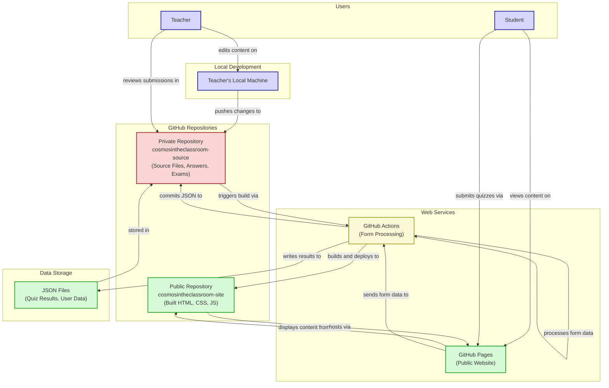

```mermaid

flowchart TD
    subgraph LocalDev["Local Development"]
        LocalMachine["Teacher's Local Machine"]
    end

    subgraph GitHub["GitHub Repositories"]
        PrivateRepo["Private Repository\ncosmosintheclassroom-source\n(Source Files, Answers, Exams)"]
        PublicRepo["Public Repository\ncosmosintheclassroom-site\n(Built HTML, CSS, JS)"]
    end

    subgraph Users["Users"]
        Teacher["Teacher"]
        Student["Student"]
    end

    subgraph WebServices["Web Services"]
        GitHubPages["GitHub Pages\n(Public Website)"]
        GitHubActions["GitHub Actions\n(Form Processing)"]
    end

    subgraph Storage["Data Storage"]
        JSONFiles["JSON Files\n(Quiz Results, User Data)"]
    end
    
    %% Teacher workflows
    Teacher -->|edits content on| LocalMachine
    LocalMachine -->|pushes changes to| PrivateRepo
    PrivateRepo -->|triggers build via| GitHubActions
    GitHubActions -->|builds and deploys to| PublicRepo
    
    %% Student workflows
    Student -->|views content on| GitHubPages
    Student -->|submits quizzes via| GitHubPages
    GitHubPages -->|displays content from| PublicRepo
    
    %% Form processing
    GitHubPages -->|sends form data to| GitHubActions
    GitHubActions -->|processes form data| GitHubActions
    GitHubActions -->|writes results to| JSONFiles
    GitHubActions -->|commits JSON to| PrivateRepo
    
    %% Teacher review
    Teacher -->|reviews submissions in| PrivateRepo
    JSONFiles -->|stored in| PrivateRepo
    
    %% Website updates
    PublicRepo -->|hosts via| GitHubPages
    
    %% Styling
    classDef private fill:#f9d6d6,stroke:#a12222,stroke-width:2px
    classDef public fill:#d6f9d6,stroke:#22a122,stroke-width:2px
    classDef user fill:#d6d6f9,stroke:#2222a1,stroke-width:2px
    classDef service fill:#f9f9d6,stroke:#a1a122,stroke-width:2px
    
    class PrivateRepo private
    class PublicRepo,GitHubPages,JSONFiles public
    class Teacher,Student,LocalMachine user
    class GitHubActions service

```