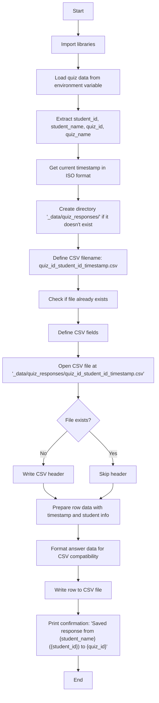

```mermaid
flowchart TD
    A[Start] --> B[Import libraries]
    B --> C[Load quiz data from environment variable]
    C --> D[Extract student_id, student_name, quiz_id, quiz_name]
    D --> E[Get current timestamp in ISO format]
    E --> F["Create directory '_data/quiz_responses/' if it doesn't exist"]
    F --> G["Define CSV filename: quiz_id_student_id_timestamp.csv"]
    G --> H[Check if file already exists]
    H --> I[Define CSV fields]
    I --> J["Open CSV file at '_data/quiz_responses/quiz_id_student_id_timestamp.csv'"]
    J --> K{File exists?}
    K -- No --> L[Write CSV header]
    K -- Yes --> M[Skip header]
    L --> N[Prepare row data with timestamp and student info]
    M --> N
    N --> O[Format answer data for CSV compatibility]
    O --> P[Write row to CSV file]
    P --> Q["Print confirmation: 'Saved response from {student_name} ({student_id}) to {quiz_id}'"]
    Q --> R[End]
```

