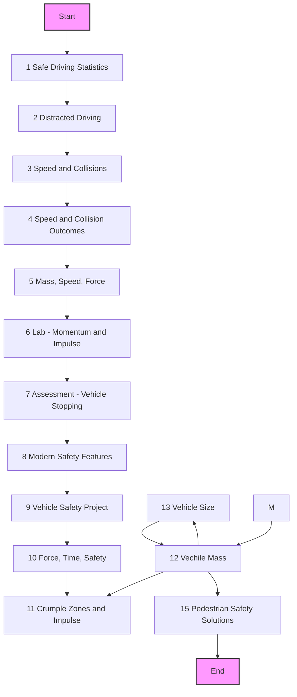

## P3 Force, Impulse, and Collision Safety

### Overview of the Unit
- **Unit Title**: Force, Impulse, and Collision Safety
- **Unit Duration**: 4-6 weeks
- **Unit Description**: This unit focuses on the physics of collisions, impulse, and safety features in vehicles. Students will explore the forces involved in collisions, the role of speed and mass, and modern safety features designed to protect passengers and pedestrians. The unit culminates in a project where students design their "dream car" with safety features in mind.

### L1 - Safe Driving Statistics
- Data Discussion
 - Prevalence of auto injuries/fatalities
 - Predictions about causes/reasons
 - Review historical US Data (injuries/fatalities)
- Modeling Collisions
 - YouTube Videos and Strips of Paper Models
 - Factors & Features That Determine Collision Outcomes
 - Annotate a timeline with factors and features that affect collision outcomes

### L2 - Distracted Driving 
- Graphing: Distracted vs. non-distracted driving
 - **P/T and V/T graphs**
- **Home Learning** : Distracted Driver Research and calculations of $v=\Delta t
$v$ and $a=\Delta t/\Delta t$ (acceleration)

 

### L3 - Speed and Collisions (avoidance)
- V-T Graphing
- Calculating Reaction Distances
- Discussion : Speed Limits
- Engineering : Engineering Faster Reaction Times (HUD, Cameras, DND Settings on Phones)
- Home Learning : Speed Limits (reading) (Validity and Reliability?)

### L4 - Speed and Collision (outcomes)

- Analyzing Collision Data
 - YouTube Videos of Green/Blue Carts
 - Collisions A - D
- Force, velocity, and Newton's Laws
### L5 - Mass, Speed, Force

### L6 - Lab - Momentum and Impulse Carts

### L7 - Assessment - Vehicle Stopping Times

### L8 - Modern Safety Features

## Vehicle Safety Project

 ### L9 - Force, Time, Safety

 ### L10 - Crumple Zones and Impulse

 ### L11 - Vehicle Mass

 ### L12 Vehicle Size

 ### L13 Designing the "Dream Car"

 ### L14 Transfer Task - Pedestrian Safety Solutions
