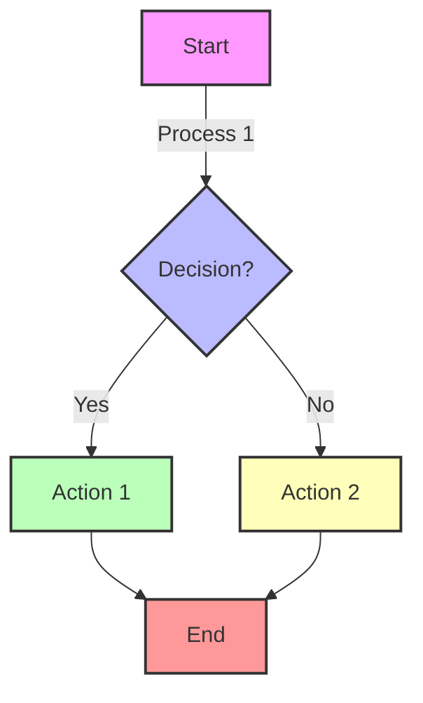

```mermaid
flowchart TD
    A[Evidence for Interactions: Amplitude & Frequency] --> B[Wave Model Evidence]
    B --> C[Particle Model Evidence]
    C --> || Wave-Particle Duality || --> D[Wave-Particle Duality]
    C --> D[Wave-Particle Duality]
    D --> E[Conclusion: X-ray Imaging]
    E --> F[Transfer Task Practice]
    ```