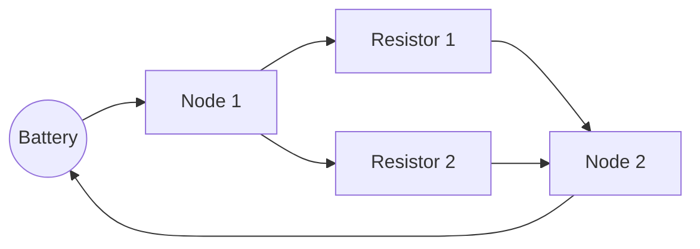

# Simple Parallel Circuit

```mermaid
graph LR
    B((Battery)) --> N1[Node 1]
    N1 --> R1[Resistor 1]
    N1 --> R2[Resistor 2]
    R1 --> N2[Node 2]
    R2 --> N2
    N2 --> B
```

In this parallel circuit:
- One battery connects to two resistors
- Current splits at Node 1
- Voltage is the same across both resistors
- Current recombines at Node 2