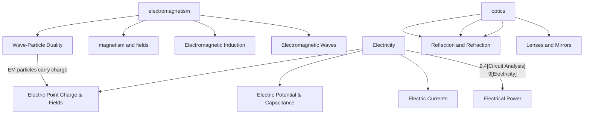

```mermaid
    flowchart TD
        8[electromagnetism] --> 8.1[magnetism and fields]
        8[electromagnetism] --> 8.2[Electromagnetic Induction]
        8[electromagnetism] --> 8.3[Electromagnetic Waves]
        8[electromagnetism] --> 8.4[Wave-Particle Duality]
        
        8.4--> |EM particles carry charge| 9.1
        9[Electricity]--> 9.1[Electric Point Charge & Fields]
        9[Electricity]--> 9.2[Electric Potential & Capacitance]
        9[Electricity]-->9.3[Electric Currents]
        9[Electricity]--9.4[Circuit Analysis]
        9[Electricity]--> 9.5[Electrical Power]
        
        10[optics]--> 10.1[Quantum and Modern Physics]
        10[optics]--> 10.1[Reflection and Refraction]
        10[optics]--> 10.2[Lenses and Mirrors]
        10[optics]--> 10.1[Reflection and Refraction]

```