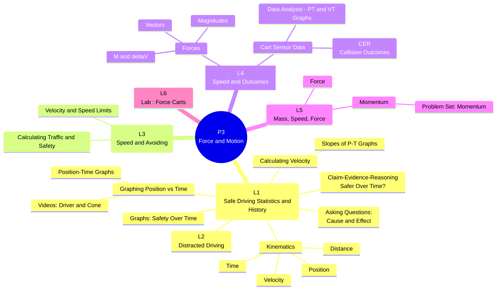

```mermaid
    mindmap
        root((P3 <br> Force and Motion))
            (L1 <br> Safe Driving Statistics and History)
                Graphs: Safety Over Time
                Asking Questions: <br> Cause and Effect
                Claim-Evidence-Reasoning <br> Safer Over Time?
                L2 <br> Distracted Driving
                Kinematics
                    Velocity
                    Distance
                    Time
                    Position
                Graphing Position vs Time
                    Position-Time Graphs
                    Videos: Driver and Cone
                Calculating Velocity
                    Slopes of P-T Graphs
            (L3 <br> Speed and Avoiding)
                Velocity and Speed Limits
                Calculating Traffic and Safety
            [L4 <br> Speed and Outcomes]
                Forces
                    Vectors
                    Magnitudes
                    M and deltaV
                Cart Sensor Data
                    Data Analysis - PT and VT Graphs
                
                    CER <br> Collision Outcomes
            L5 <br> Mass, Speed, Force
                Momentum
                    Problem Set: Momentum
                Force

            L6 <br> Lab : Force Carts

            
```