# Mermaid Markdown Reference Sheet

Mermaid is a JavaScript-based diagramming and charting tool that renders Markdown-inspired text definitions to create diagrams dynamically.

## Basic Syntax

Mermaid diagrams in Markdown are created using code blocks with the `mermaid` language identifier:


<li style: |
        font-family: Garamond;
        padding: 20px
        ></style>

```mermaid
diagram-code-here
```

</li>
````

## Diagram Types

### Flowchart

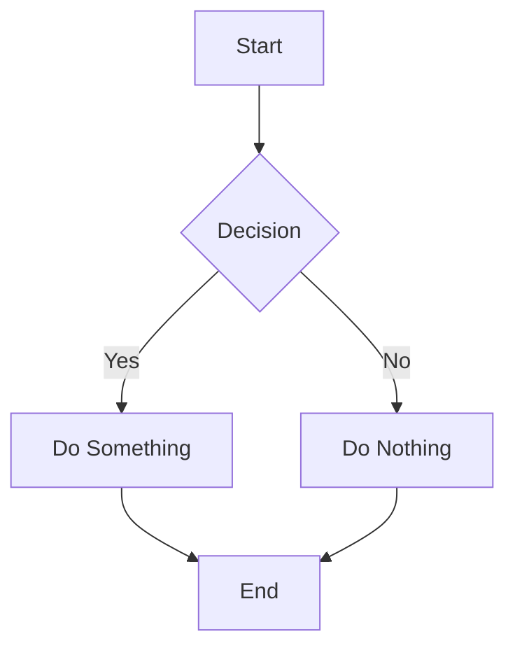

**Basic Syntax:**
```
graph [direction]
    node1[Text] --> node2[Text]
```

**Directions:** TB (top-bottom), TD (same as TB), BT (bottom-top), RL (right-left), LR (left-right)

**Node Shapes:**
- `[]` Rectangle: `A[Text]`
- `()` Rounded: `B(Text)`
- `{}` Diamond: `C{Text}`
- `[[]]` Subroutine: `D[[Text]]`
- `[()]` Stadium: `E[(Text)]`
- `[()] Cylinder: `F[(Database)]`
- `>]` Asymmetric: `G>Text]`

**Connections:**
- `-->` Arrow: `A --> B`
- `---` Line: `A --- B`
- `-.->` Dotted arrow: `A -.-> B`
- `==>` Thick arrow: `A ==> B`
- `-->|text|` Labeled arrow: `A -->|Yes| B`

### Sequence Diagram

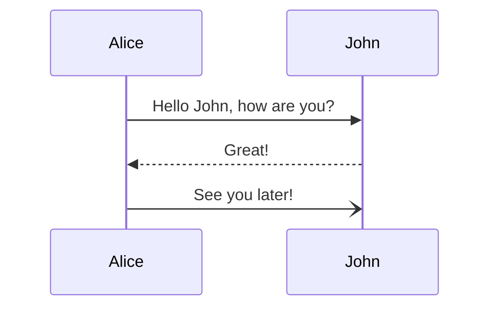

**Basic Syntax:**
```
sequenceDiagram
    participant A
    participant B
    A->>B: Message
```

**Arrows:**
- `->>` Solid arrow: `A->>B`
- `-->>` Dotted arrow: `A-->>B`
- `-x` Lost arrow: `A-xB`
- `-)` Open arrow: `A-)B`

**Notes:**

`
Note over A: Note Text
Note over A,B: Note spanning actors
`


```
Note over A: Note text
Note over A,B: Note spanning actors
```

### Class Diagram

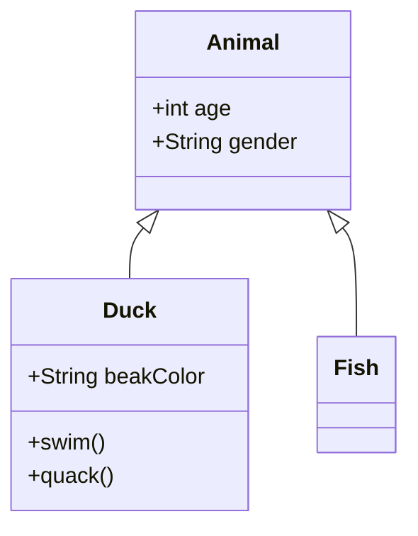

**Basic Syntax:**
```
classDiagram
    class ClassName
    ClassName : +attribute
    ClassName : +method()
```

**Relationships:**
- `<|--` Inheritance: `Parent <|-- Child`
- `*--` Composition: `Car *-- Engine`
- `o--` Aggregation: `Department o-- Employee`
- `-->` Association: `Student --> Course`
- `..|>` Realization: `Interface ..|> Class`
- `..>` Dependency: `Class ..> Helper`

### Gantt Chart

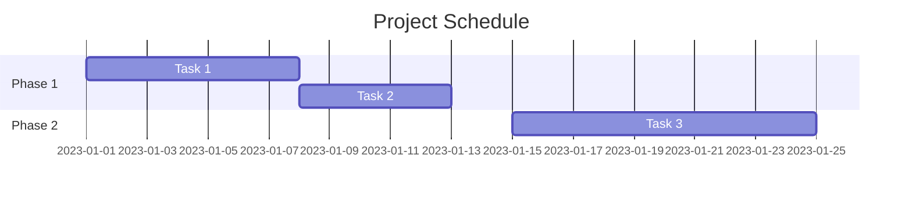

**Basic Syntax:**
```
gantt
    title Title
    dateFormat YYYY-MM-DD
    section Section
    Task name  :id, start-date, duration
```

### Entity Relationship Diagram

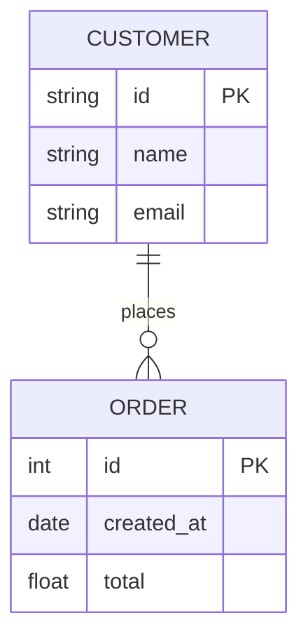

**Basic Syntax:**
```
erDiagram
    ENTITY_A {
        type attribute PK
    }
    ENTITY_A |o--|| ENTITY_B : relationship
```

**Relationships:**
- `||--||` One-to-one
- `||--o{` One-to-many
- `}o--o{` Many-to-many

### Pie Chart

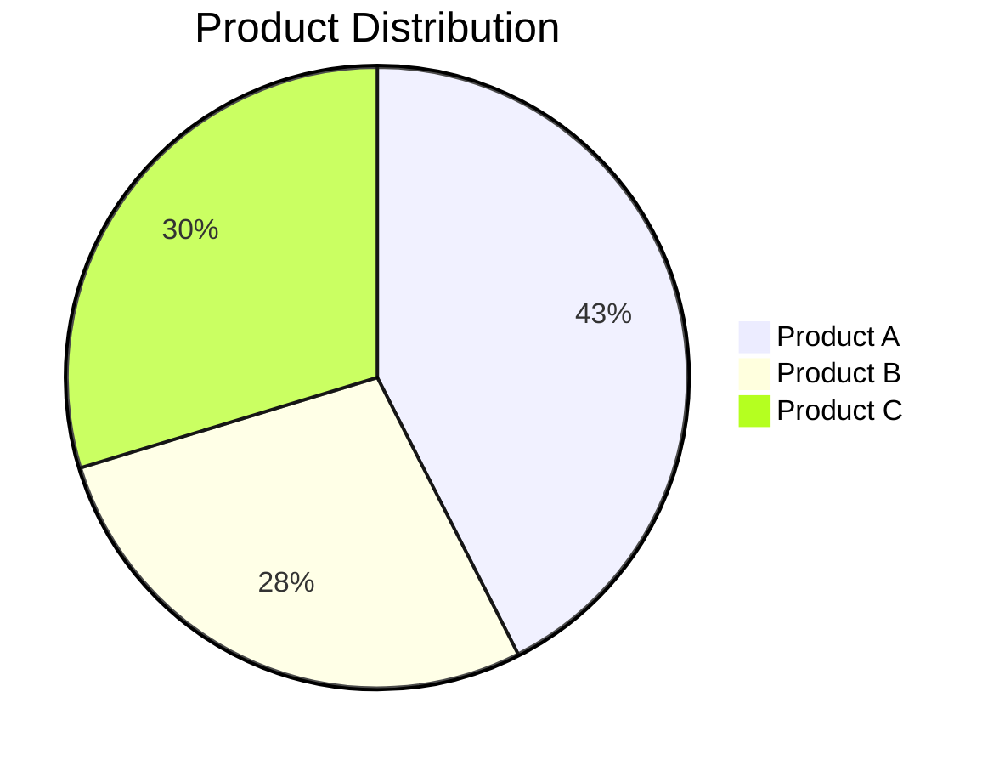

**Basic Syntax:**
```
pie title Title
    "Slice 1" : value1
    "Slice 2" : value2
```

### State Diagram

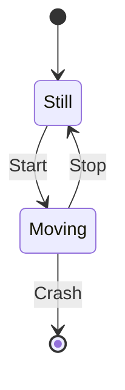

**Basic Syntax:**
```
stateDiagram-v2
    s1 --> s2 : transition
    s2 --> [*] : end
```

## Tips & Best Practices

1. Keep diagrams simple and focused
2. Use clear, descriptive labels
3. Maintain consistent styling
4. Use appropriate diagram type for the content
5. Add comments to complex sections: `%% Comment text %%`
6. Test diagrams in a Mermaid Live Editor for complex structures
7. Limit node count to maintain readability

## Resources

- [Mermaid Official Documentation](https://mermaid.js.org/intro/)
- [Mermaid Live Editor](https://mermaid.live/)


Yes, you can customize colors and styles in Mermaid diagrams using built-in styling options. While it's not CSS in the traditional sense, Mermaid provides several ways to style your diagrams:

### 1. Inline Styling

You can apply styles directly to nodes and connections:

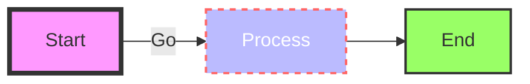

### 2. Classes

You can define classes and apply them to multiple elements:

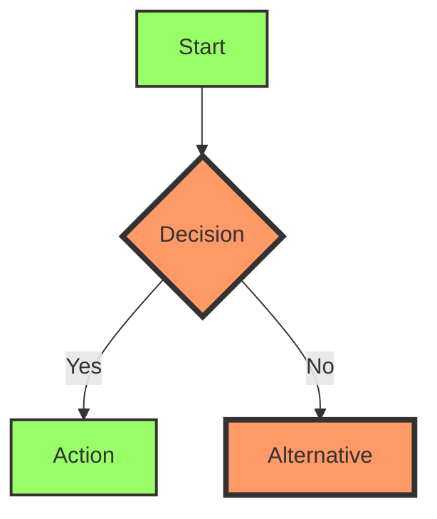

### 3. Default Styling

You can set default styles for all nodes:

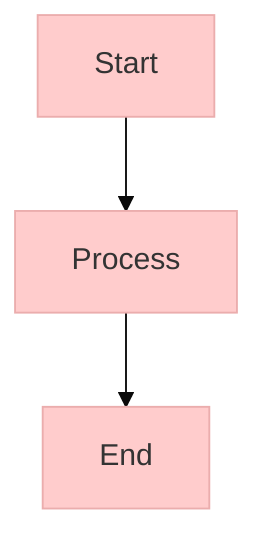

### 4. Theme Selection

Mermaid supports several built-in themes:

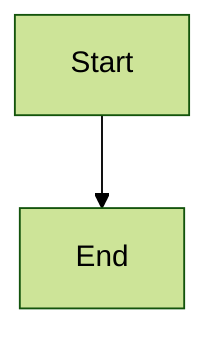

Available themes include: default, neutral, dark, forest, and base.

### Key Style Properties

For individual elements, you can set:
- `fill`: Background color
- `stroke`: Border color
- `stroke-width`: Border thickness
- `color`: Text color
- `stroke-dasharray`: For dashed lines
- `font-size`: Text size
- `font-family`: Font type

### Notes on CSS Integration

- Mermaid doesn't directly use external CSS files
- Styles are contained within the diagram definition
- You can use HTML color codes (#RGB) or color names
- For web applications, you can style the container div that holds the Mermaid diagram using regular CSS

Would you like me to demonstrate any specific styling technique in more detail?