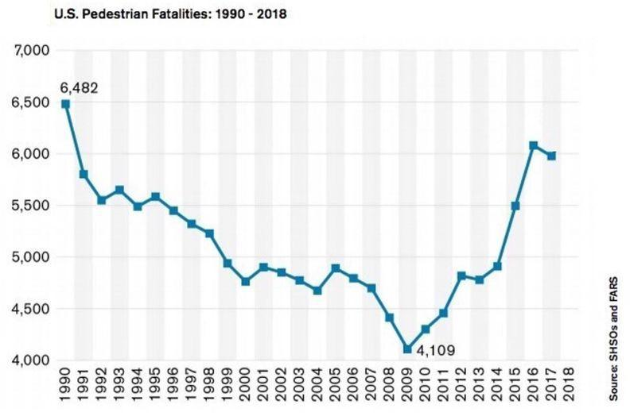

Distracted Driving Research

Before you begin, consider: What questions do you have about distracted driving that you hope will be answered in this reading?

Reaction Time
It can be difficult to notice what is going on around you when your mind is focused on something else. Has your friend or family member ever tried to get your attention when you were doing homework or reading a text? It may take a couple of moments before you look up. When your brain is busy you do not have as much capacity to process the stimulus of someone calling your name, so it may take you a long time to respond.

The time between a stimulus (like your friend calling your name) and your response (looking up) is called your reaction time. A quick reaction time can mean the difference between life and death. When a Wildebeest sees a lion (stimulus), it needs to run to survive (response). When a sunflower senses a drop in sunlight (stimulus), it needs to face in a new direction (response).

All animals and plants have receptors that help them respond to stimuli. In humans, stimuli are received by our eyes, ears, nose, and skin and transmitted as signals that travel along nerve cells to the brain. The signals are then processed in the brain, resulting in immediate behaviors or memories.

Pause to reflect: What information did you obtain from this section that might help you make progress on your questions?

Research on Reaction Time
Reaction time is the subject of a lot of scientific research right now because people are concerned about vehicle collisions. An analysis of data reported by State Highway Safety Offices (SHSOs) projects that 6,721 pedestrians were killed on U.S. roads in 2020, up 4.8% from 6,412 fatalities in 2019. The numbers for 2021 and 2022 are projected to be even higher.

Researchers at the Texas Transportation Institute are among those who are trying to make sense of these trends. The researchers studied how texting can impact reaction time, the first U.S. study to do so in an actual driving environment. They studied 42 drivers between the ages of 16 and 54.

First, the researchers asked participants to type, read and answer questions on their phones while still in the laboratory. Each participant then drove around a track. The track had one section that was open, and one section that was lined with barrels. First the participants were asked to drive the course without texting. Then they repeated the same tasks they were asked to do in the lab while driving through the course again. As they drove, they were asked to react to a flashing light. The researchers recorded the time it took for the participants to react to the light while driving without texting, and while texting.

What they found was clear. The drivers’ reaction time doubled on average when they were distracted by reading or sending the text messages. Participants reacted in about 1-2 seconds when they were not distracted. But when they were distracted, their reaction times were at least 3-4 seconds. And the distracted drivers were more than 11 times more likely to miss the flashing light altogether. This was an even greater effect than many experts predicted.

In addition to doubling their reaction time, the drivers who were texting were more likely to swerve out of their lanes, and slow down instead of maintaining a constant speed.

Pause to reflect: What information did you obtain from this section that might help you make progress on your questions?

Conclusion

The study was sponsored by the Southwest Region University Transportation Center, and was managed by Christine Yager. “Most research on texting and driving has been limited to driving simulators. This study involved participants driving an actual vehicle, “Yager explained. “So one of the more important things we know now that we didn’t know before is that response times are even slower than we previously thought.”

The researchers also pointed out that driving in the real world presents far more challenges and distractions than driving on a course. “It is frightening,” they cautioned, “to think of how much more poorly our participants may have performed if the driving conditions were more consistent with routine driving.”

 At least 20 percent of all drivers have admitted to texting while driving. Meanwhile, pedestrian deaths due to vehicle collisions are on the rise (see the graph below). We cannot claim that distracted driving is the cause of this trend because there is no way to test this hypothesis empirically. But research supported by government agencies now suggests that distracted driving contributes to as much as 20 percent of all fatal crashes, and that cell phones constitute the primary source of driver distraction. As pedestrian deaths and vehicle collision statistics rise, we need more solutions to keep people safe.

Answer the following questions on the form in Google Classroom
1. What clues did you see in the reading that indicated whether the information presented was reliable?
 Reliable claims use evidence that comes from credible sources, and can be verified against either data sets or additional experiments.

2. According to this reading, how does being distracted impact how long it takes for a car to stop?
