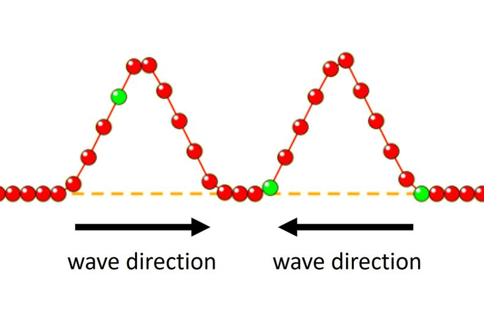

# Waves on a String - Part II

## Wave Interference

We have explored how waves interact with matter when the two come into contact with particles in matter. In this simulation, examine how waves interact when they come in contact with one another.

>Use this [link](https://phet.colorado.edu/sims/html/wave-on-a-string/latest/wave-on-a-string_all.html) to reach the simulation for this investigation.

### Interaction A
In your lab notebook, open to a fresh page and add a heading for Wave Interference. Produce a copy of the three-box table below; this is where you will make sketches of the wave interactions before, during, and after the two waves cross the same point in space and time.

{: style="display: block; margin: 0 auto; width: 40%; box-shadow: 0 4px 8px rgba(0, 0, 0, 0.2); border: 1.5px solid #999;"}

{: .figure-caption}
**Figure 1**. Interaction A - two waves of equal and same-sided amplitudes approach one another.

{: .figure-caption}
**Table 1**. Visualization of waves (a) before (b) during and (c) after occupying the same space.

|Before|During|After|
|-|-|-|
|||

Open the simulation and select the “Pulse” and “Loose End” settings at the top.
At the bottom, select the following settings:
- “Amplitude” to 1.25 cm
- “Pulse Width” to 1 second
- “Damping” to none
- “Tension” low

Produce two waves similar to the “before” diagram above and run the simulation. Run the simulation and complete the diagrams in Table 1 above.

### Interaction B
In your lab notebook, open to a fresh page and add a heading for Wave Interference. Produce a copy of the three-box table below; this is where you will make sketches of the wave interactions before, during, and after the two waves cross the same point in space and time.

{: style="display: block; margin: 0 auto; width: 40%; box-shadow: 0 4px 8px rgba(0, 0, 0, 0.2); border: 1.5px solid #999;"}

{: .figure-caption}
**Figure 2**. Interaction B - two waves of equal and opposite-sided amplitudes approach one another.

{: .figure-caption}
**Table 2**. Visualization of waves (a) before (b) during and (c) after occupying the same space.

|Before|During|After|
|-|-|-|
||||

Open the simulation and select the “Pulse” and “Loose End” settings at the top.
At the bottom, select the following settings:
- “Amplitude” to 1.25 cm
- “Pulse Width” to 1 second
- “Damping” to none
- “Tension” low

Produce two waves similar to the “before” diagram above and run the simulation.
When the waves meet at the same place in space, how does the total energy when the waves meet compare with the total energy before? How do you know?

In your lab notebook, draw what you see happening with the matter during the interaction.
From a force perspective, explain the changes in the matter that we observe during the interaction.

In your lab notebook, draw what you see happening with the matter after the interaction.
After the waves meet at the same place in space, how does the total energy compare with the total energy before?

### Interaction C
Produce a copy of the three-box table below; this is where you will make sketches of the wave interactions before, during, and after the two waves cross the same point in space and time. Note that the waves are no longer of the same amplitude.

{: style="display: block; margin: 0 auto; width: 40%; box-shadow: 0 4px 8px rgba(0, 0, 0, 0.2); border: 1.5px solid #999;"}

{: .figure-caption}
**Figure 3**. Interaction C - two waves of *unequal* and opposite-sided amplitudes approach one another.

{: .figure-caption}
**Table 3**. Visualization of waves (a) before (b) during and (c) after occupying the same space.

|Before|During|After|
|-|-|-|
||||

### Interaction D
Produce a copy of the three-box table below; this is where you will make sketches of the wave interactions before, during, and after the two waves cross the same point in space and time. Note that the waves are no longer of the same amplitude.

{: style="display: block; margin: 0 auto; width: 40%; box-shadow: 0 4px 8px rgba(0, 0, 0, 0.2); border: 1.5px solid #999;"}

{: .figure-caption}
**Figure 4**. Interaction D - two waves of *unequal* and same-sided amplitudes approach one another.

**Table 4**. Visualization of waves (a) before (b) during and (c) after occupying the same space.

|Before|During|After|
|-|-|-|
||||

Label this set of interaction diagrams “Interaction D”
Before
During
After

#### Analysis Questions

1. Compare Interactions A and B. What principle explains why the waves add differently when they meet? Use the term "superposition" in your explanation.

2. In Interaction A, we observe constructive interference. What happens to:
   a) The amplitude during the interaction compared to the original waves?
   b) The energy of the system during this moment?

3. In Interaction B, we observe destructive interference. Explain:
   a) Why does the string appear flat when the waves perfectly overlap?
   b) Where does the energy go during this moment?

4. For Interactions C and D with unequal amplitudes:
   a) How does the resultant wave amplitude compare to the individual wave amplitudes?
   b) What determines whether the interaction will be constructively or destructively interfering?

5. Based on all observations, what can you conclude about:
   a) Energy conservation during wave interactions?
   b) The permanent effects (if any) of wave interference on the individual waves?