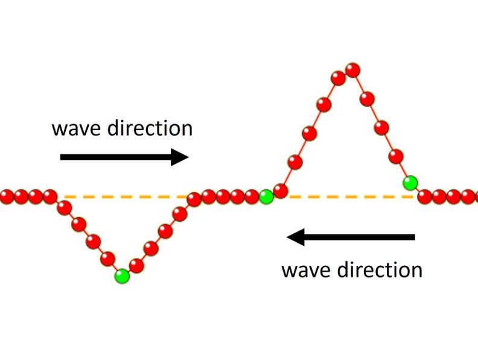
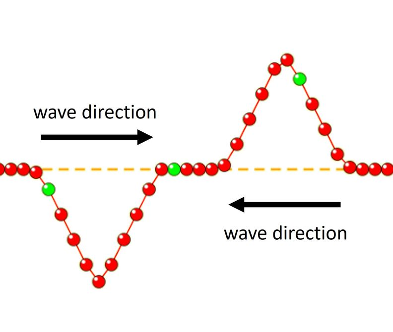
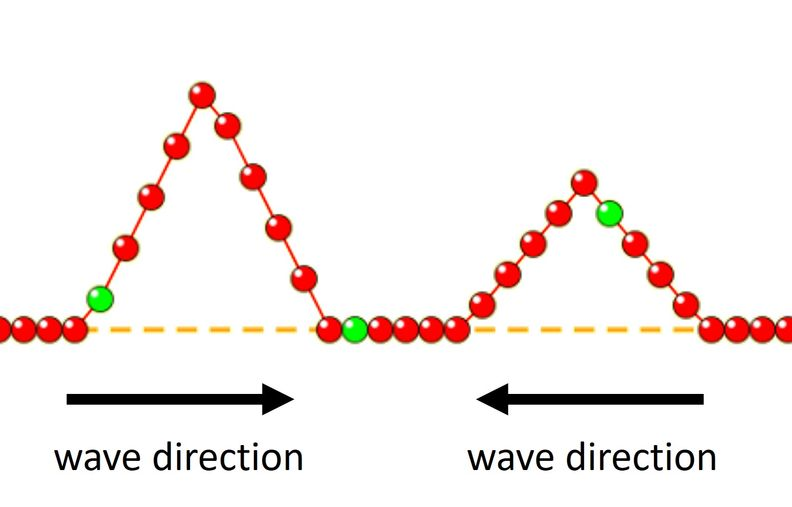

# Waves on a String - Part II

## Wave Interference

We have explored how waves interact with matter when the two come into contact.
In this simulation, examine how waves interact when they come in contact with one another.
Use this [link](https://phet.colorado.edu/sims/html/wave-on-a-string/latest/wave-on-a-string_all.html) to reach the simulation for this investigation.

### Interaction A
In your lab notebook, open to a fresh page and add a heading for Wave Interference. Produce a copy of the three-box table below; this is where you will make sketches of the wave interactions before, during, and after the two waves cross the same point in space and time.

{: .figure-caption}
**Table 1**. Visualization of waves (a) before (b) during and (c) after occupying the same space.

|Before|During|After|
|-|-|-|
|![Interaction A]|||

Open the simulation and select the “Pulse” and “Loose End” settings at the top.
At the bottom, select the following settings:
- “Amplitude” to 1.25 cm
- “Pulse Width” to 1 second
- “Damping” to none
- “Tension” low

Produce two waves similar to the “before” diagram above and run the simulation. Run the simulation and complete the diagrams in Table 1 above.

#### Questions
1. When the waves meet at the same place in space, how does the total energy when the waves meet compare with the total energy before? 
2. In your lab notebook, draw what you see happening with the matter during the interaction.
3. From a force perspective, explain the changes in the matter that we observe during the interaction
4. In your lab notebook, draw what you see happening with the matter after the interaction.
5. After the waves meet at the same place in space, how does the total energy compare with the total energy before?

### Interaction B asdaf
In your lab notebook, open to a fresh page and add a heading for Wave Interference. Produce a copy of the three-box table below; this is where you will make sketches of the wave interactions before, during, and after the two waves cross the same point in space and time.

{: .figure-caption}
**Table 2**. Visualization of waves (a) before (b) during and (c) after occupying the same space.

|Before|During|After|
|-|-|-|
||||

Open the simulation and select the “Pulse” and “Loose End” settings at the top.
At the bottom, select the following settings:
- “Amplitude” to 1.25 cm
- “Pulse Width” to 1 second
- “Damping” to none
- “Tension” low

Produce two waves similar to the “before” diagram above and run the simulation.
When the waves meet at the same place in space, how does the total energy when the waves meet compare with the total energy before? How do you know?

In your lab notebook, draw what you see happening with the matter during the interaction.
From a force perspective, explain the changes in the matter that we observe during the interaction.

In your lab notebook, draw what you see happening with the matter after the interaction.
After the waves meet at the same place in space, how does the total energy compare with the total energy before?

### Interaction C
Produce a copy of the three-box table below; this is where you will make sketches of the wave interactions before, during, and after the two waves cross the same point in space and time.

Note that the waves are no longer of the same amplitude.

{: .figure-caption}
**Table 3**. Visualization of waves (a) before (b) during and (c) after occupying the same space.

|Before|During|After|
|-|-|-|
||||

### Interaction D
Produce a copy of the three-box table below; this is where you will make sketches of the wave interactions before, during, and after the two waves cross the same point in space and time.

Note that the waves are no longer of the same amplitude.

{: .figure-caption}
**Table 4**. Visualization of waves (a) before (b) during and (c) after occupying the same space.

|Before|During|After|
|-|-|-|
||||

Label this set of interaction diagrams “Interaction D”
Before
During
After

Predict what you expect to see happening with the matter during and after the interaction.