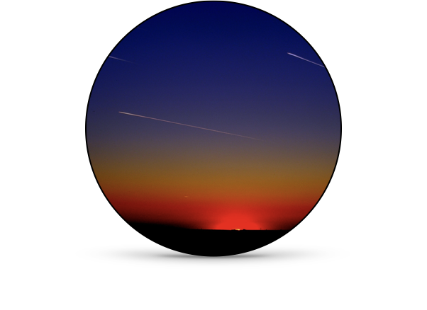

# Cosmos in the Classroom

  
  
Aristotle's contributions to early astronomy

  
  
Meteor shower observation guide

  
  
Aurora Borealis and atmospheric physics

  
  
Atmospheric effects on astronomical observations

## References

$$F=m \cdot a$$

The [Reference Landing] is here.

The [Honors Physics Landing] page is accessible from here.

The [Standard Physics Landing] page provides an overview.

The [LaTeX Reference] is available for mathematical notation help.

[Reference Landing]: https://cosmosintheclassroom.org/src/ref/ref_lib
[Honors Physics Landing]: https://cosmosintheclassroom.org/src/hphys/hphys_landing
[Standard Physics Landing]: https://cosmosintheclassroom.org/src/sphys/sphys_overview
[LaTeX Reference]: https://cosmosintheclassroom.org/src/ref/ref_latex
