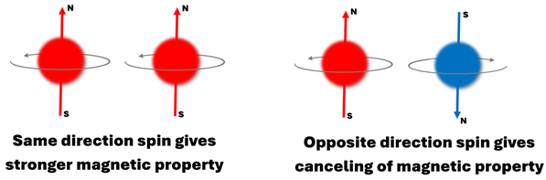

# Cosmos in the Classroom

$\vec{F} = m \cdot \vec{a}$

### Quick Links

- [Honors Physics](https://cosmosintheclassroom.org/src/hphys/hphys_landing)
- [Standard Physics](https://cosmosintheclassroom.org/src/sphys/sphys_overview)

### Resources

- [Reference Library](https://cosmosintheclassroom.org/src/ref/ref_lib)
- [LaTeX Guide](https://cosmosintheclassroom.org/src/ref/ref_latex)

---

