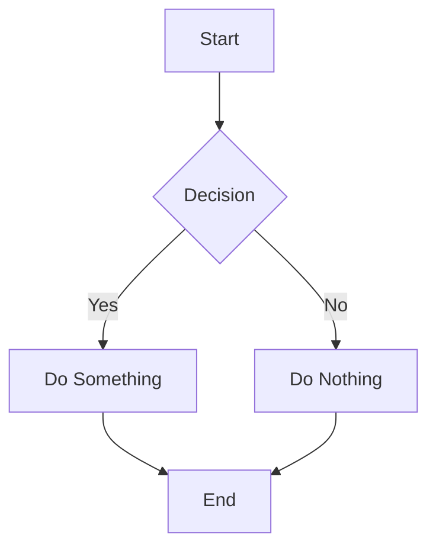
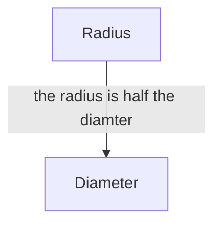
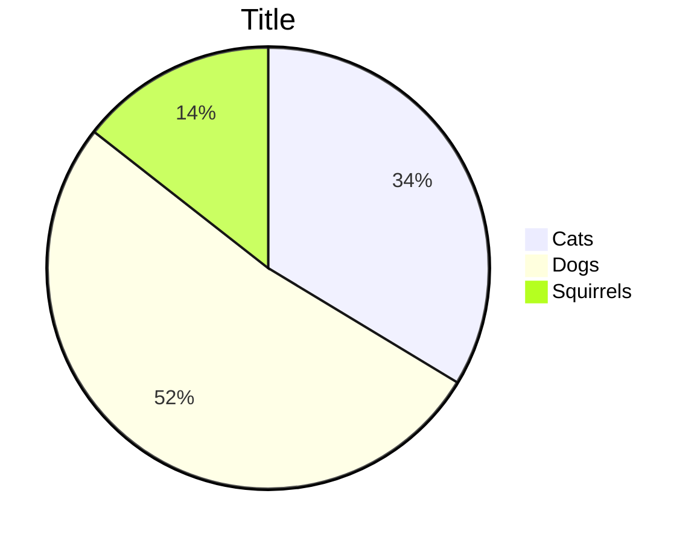

<!-- cosmosintheclassroom\src\hphys\6_circ_grav\cmap_circles.md -->

```mermaid
graph TD
    A[Start] --> B{Decision}
    B -->|Yes| C[Do Something]
    B -->|No| D[Do Nothing]
    C --> E[End]
    D --> E
```
<section>

```mermaid
graph TD
    Radius -->|the radius is half the diamter| Diameter


```

</section>

```mermaid
%%{init: { 'theme': 'default'}}%%
pie title Title
    "Cats" : 35
    "Dogs" : 54
    "Squirrels" : 15
```

# is there any goodness left in this cruel world?