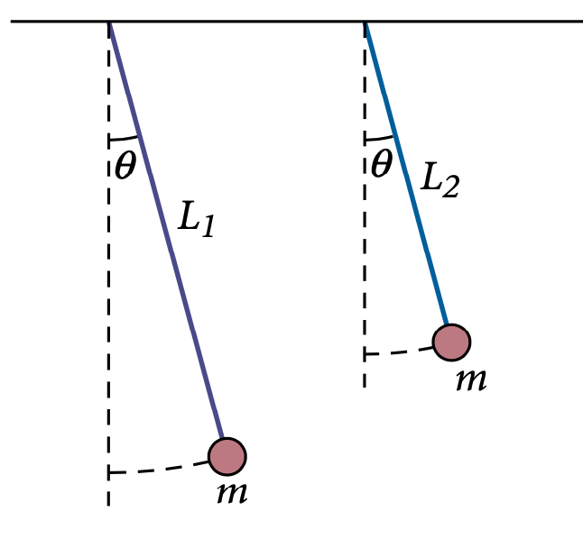
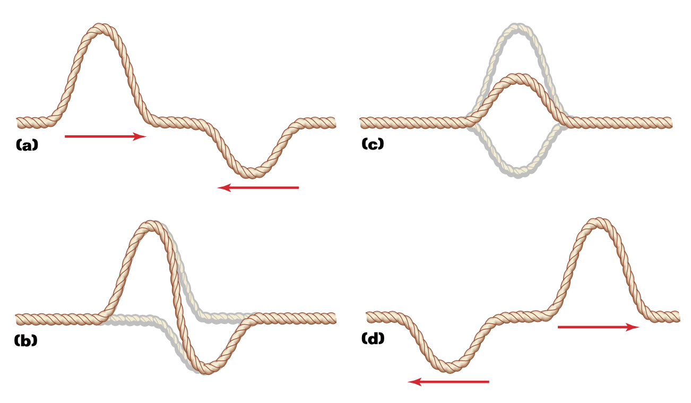
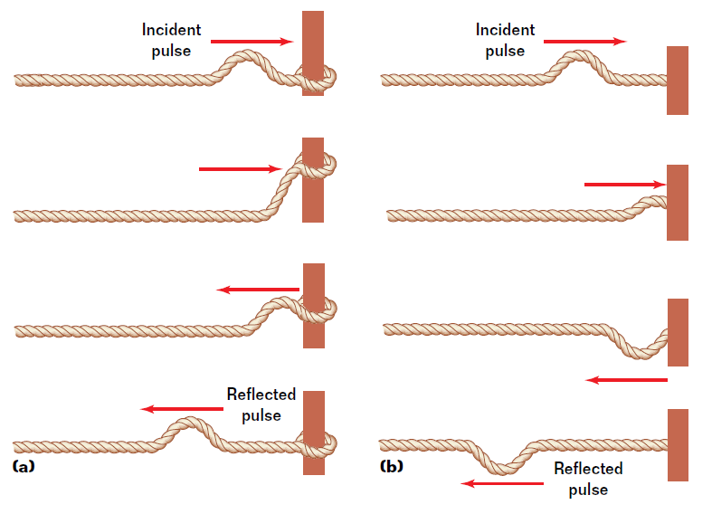

# 8 Harmonics and Waves

How can regular, repeating motion be described with waves?

---

## Contents

1. Simple Harmonic Motion
2. Springs and Hooke's Law
3. Pendulums
4. Energy in Harmonic Motion
5. Wave Properties
6. Wave Interactions

---

## Harmonics

Many objects in our world **oscillate** - springs, pendulums, tuning forks, guitar strings, and even molecules in matter.

When an object vibrates back and forth over the same path, with each oscillation taking the same amount of time, the motion is called **periodic**.

**Oscillate**: to move in a repeating motion, retracing a fixed path

---

## Simple Harmonic Motion

An oscillating object undergoes simple harmonic motion (SHM) when the restoring force is directly proportional to the displacement from equilibrium:

$$ F = -k \cdot x $$

Where:
- $k$ is the spring constant (stiffness)
- $x$ is displacement from equilibrium
- The negative sign indicates the force acts in the opposite direction of the displacement

This relationship is known as **Hooke's Law**.

---

## Restoring Force

The restoring force always acts to return the system to its equilibrium position:

- **In a spring**: The force pulls/pushes back to the rest position
- **In a pendulum**: The gravitational force component swings the bob back to center
- **In waves**: Tension or pressure restores displaced particles

---

## Properties of Oscillations

All oscillations can be described by three key properties:

**Amplitude (A)**: The maximum displacement from equilibrium

**Period (T)**: The time required to complete one full cycle

**Frequency (f)**: The number of cycles per second

These are related by the equation: $f = \frac{1}{T}$ or $T = \frac{1}{f}$

The unit of frequency is the Hertz (Hz) or $s^{-1}$

---

## Springs and SHM

For a mass on a spring, the period of oscillation is:

$$ T = 2\pi\sqrt{\frac{m}{k}} $$

Where:
- $m$ is the mass
- $k$ is the spring constant

An important fact: The period does not depend on the amplitude! 

This means a spring will oscillate with the same period regardless of how far you stretch it (as long as you don't exceed the elastic limit).

---

## Simple Pendulum

A simple pendulum consists of a mass (bob) suspended from a string or rod.

For small angles (less than about 15°), a pendulum's period is:

$$ T = 2\pi\sqrt{\frac{l}{g}} $$

Where:
- $l$ is the length of the pendulum
- $g$ is the acceleration due to gravity

Notice that the period depends only on length and gravity, not the mass of the bob.

---

## Energy in SHM

During simple harmonic motion, energy constantly transforms between:

**Kinetic energy**: $KE = \frac{1}{2}mv^2$ (energy of motion)

**Potential energy**: $PE = \frac{1}{2}kx^2$ (stored energy)

The total mechanical energy remains constant: $E = KE + PE$

At maximum displacement:
- All energy is potential
- Velocity is zero

At equilibrium position:
- All energy is kinetic
- Velocity is maximum

---

## Damped Oscillations

In real systems, friction causes oscillations to decrease over time:

- The amplitude gradually decreases
- Mechanical energy is converted to thermal energy
- The object eventually comes to rest

This is called **damped oscillation**.

---

## Wave Motion

A wave is a disturbance that transfers energy through a medium.

Types of waves:
- **Mechanical waves**: Require a medium (water waves, sound)
- **Electromagnetic waves**: Do not require a medium (light, radio)

In a wave, the medium's particles oscillate but don't travel with the wave - only the energy travels forward.

---

## Types of Waves

**Transverse waves**: Particles move perpendicular to the wave direction
- Examples: Water ripples, light waves, vibrating string

**Longitudinal waves**: Particles move parallel to the wave direction
- Examples: Sound waves, spring compressions

---

## Wave Properties

**Wavelength (λ)**: Distance between consecutive crests or troughs

**Amplitude (A)**: Maximum displacement from equilibrium

**Period (T)**: Time for one complete cycle to pass a point

**Frequency (f)**: Number of cycles per second

**Wave Speed (v)**: How fast the wave travels, given by: $v = fλ$ or $v = \frac{λ}{T}$

**Wave Energy**: Proportional to the square of amplitude ($E \propto A^2$)

---

## Wave Interference

When two waves occupy the same space, they combine through **superposition**:

**Constructive interference**: Waves add together (peaks align with peaks)
- Results in larger amplitude

**Destructive interference**: Waves subtract (peaks align with troughs)
- Results in smaller or zero amplitude

After interference, each wave continues unchanged.

---

## Constructive and Destructive Interference

---

## Wave Reflection

When a wave reaches a boundary:

**Free boundary** (like a wave pulse on a rope with a free end):
- Wave reflects with the same orientation
- Direction changes

**Fixed boundary** (like a rope tied to a wall):
- Wave reflects with inverted orientation
- Direction changes

---

## Standing Waves

When a medium is vibrated at specific frequencies, **standing waves** can form:

- Created by interference between incident and reflected waves
- Appear to stand in place rather than travel
- Only certain frequencies produce standing waves

Key features:
- **Nodes**: Points that never move (zero amplitude)
- **Antinodes**: Points of maximum amplitude

---

## Standing Wave Patterns

Standing waves form when the length of the medium equals exactly:
- 1/2 wavelength (fundamental)
- 1 wavelength (first harmonic)
- 3/2 wavelength (second harmonic)
- etc.

---

## Key Equations Summary

**Simple Harmonic Motion:**
- Hooke's Law: $F = -kx$
- Spring Period: $T = 2\pi\sqrt{\frac{m}{k}}$
- Pendulum Period: $T = 2\pi\sqrt{\frac{l}{g}}$

**Waves:**
- Wave Speed: $v = fλ$ or $v = \frac{λ}{T}$
- Frequency-Period Relationship: $f = \frac{1}{T}$
- Wave Energy: $E \propto A^2$

---

## Example 1: A pendulum clock

A pendulum clock is being designed to have a period of exactly 1.0 s. How long should the pendulum be?

---

**Solution:**
Using $T = 2\pi\sqrt{\frac{l}{g}}$

Rearranging: $l = \frac{T^2g}{4\pi^2}$

$l = \frac{(1.0\text{ s})^2 \times 9.8\text{ m/s}^2}{4\pi^2} = 0.25\text{ m}$

The pendulum should be 25 cm long.

---

## Example 2: Suspension on a car

The body of a 1 275 kg car is supported by four springs. Two people (153 kg combined) ride in the car. After hitting a pothole, the car vibrates with a period of 0.840 s.

Find the spring constant of the suspension system.

---

**Solution:**
Total mass = 1,275 kg + 153 kg = 1,428 kg

Using $T = 2\pi\sqrt{\frac{m}{k}}$

Rearranging: $k = \frac{4\pi^2m}{T^2}$

$k = \frac{4\pi^2 \times 1,428\text{ kg}}{(0.840\text{ s})^2} = 80,000\text{ N/m}$

---

## Example 3: A piano string

A piano string tuned to middle C vibrates with a frequency of 262 Hz. If the speed of sound in air is 343 m/s, find the wavelength of the sound waves.

---

**Solution:**
Using $v = fλ$

* Rearranging: $λ = \frac{v}{f}$

* $λ = \frac{343\text{ m/s}}{262\text{ Hz}} = 1.31\text{ m}$

* The sound wavelength is 1.31 meters.