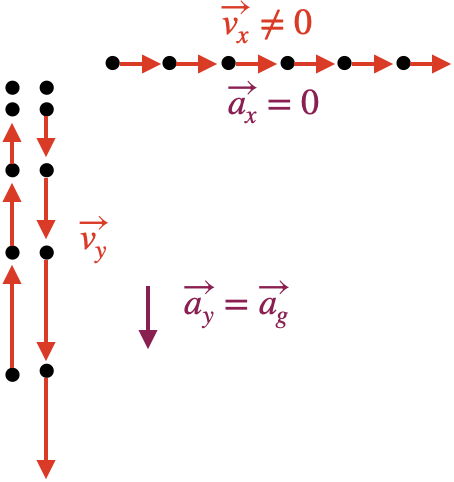
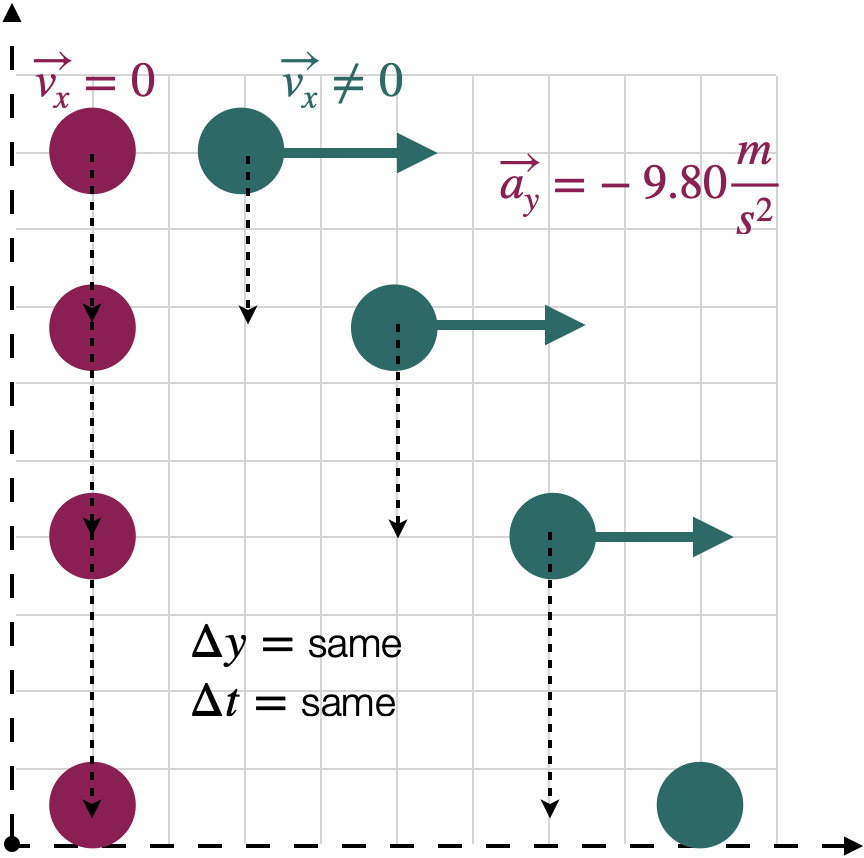
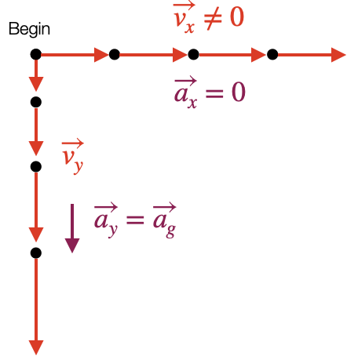
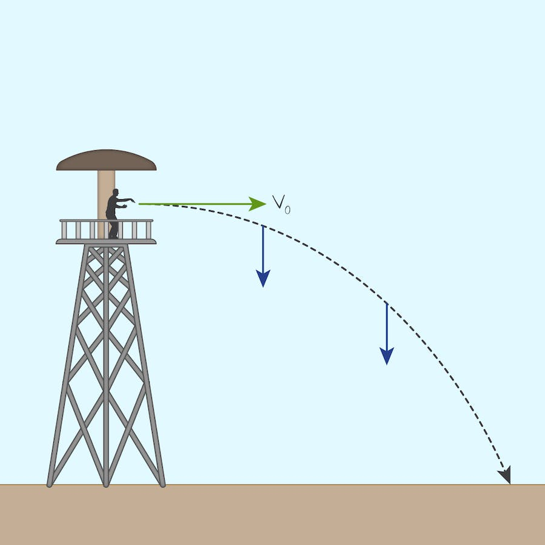
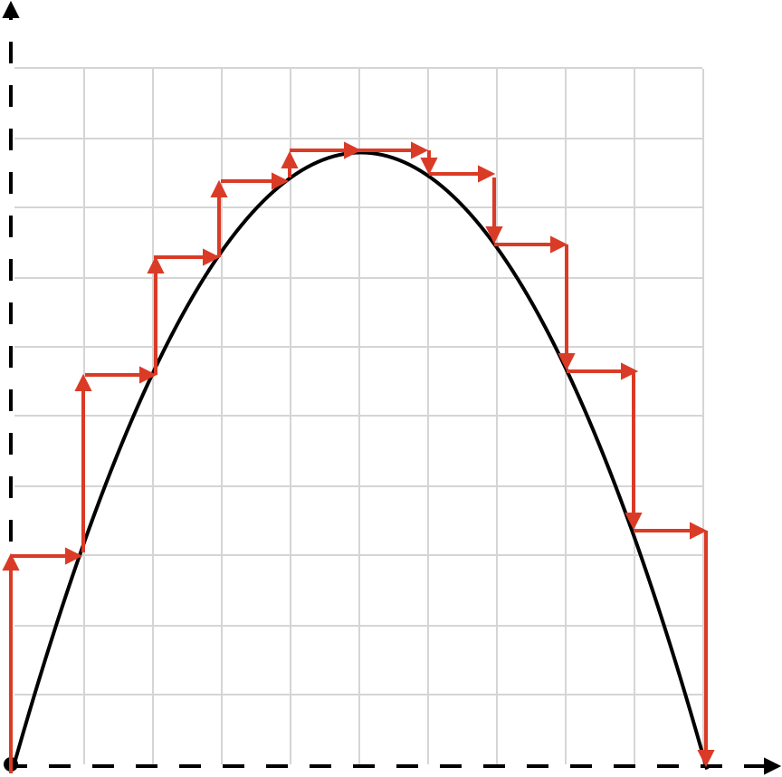
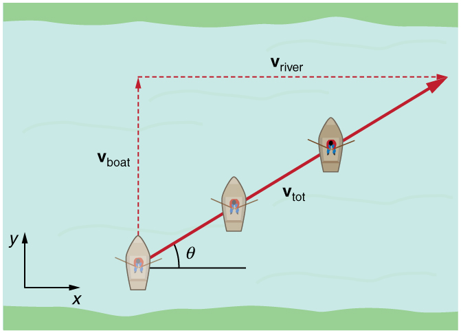
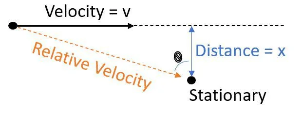

# 3.5 Projectiles

---

# How can the motion of a projectile be described?

---

# Objectives

  * __Evaluate__  __ the independence of dimensions in projectile motion problems__
  * __Calculate trajectories of objects in projectile motion__

---

# Gravity and Freefall (review)

The force \(acceleration\) of gravity can be said to be  _constant_ \*

The velocity of an object under the effect of gravity is  _variable_

Objects thrown directly upward have an initial force that overcomes gravity’s pull\.

The horizontal velocity is zero\, because it went straight up

Gravity reduces that vertical velocity\, bringing the object to a stop

Gravity then accelerates the object back toward the source of gravity \(usually a planet or moon\)

---

# Projectile Motion

Projectile \- an object shot through the air with only an initial force and gravity acting on it

Because gravity continues to act on it\, the object is accelerated downward

Any horizontal velocity remains unaffected \(when air resistance is ignored\)

Unaffected is not the same as zero

---

# Modeling objects falling with horizontal velocity

Any horizontal velocity remains unaffected by gravity \(when air resistance is ignored\)

There is no horizontal acceleration

The only vertical acceleration is gravity

---

# Horizontal velocity does not affect fall time or fall distance

An object’s motion can be broken into its vector components

---

# Trajectories in Projectile Motion are Parabolas

An object launched horizontally from some  height will follow a parabolic trajectory

Trajectory \- the path an object follows as it moves through space

If the initial force acting on an object is known\, its trajectory can be calculated

The trajectory of an object in projectile motion is \(part of\) a parabola

---

# Vector components can help model trajectory

---

# Trajectories in Projectile Motion are Parabolas

Trajectory \- the path an object follows as it moves through space

__Apex __ \- the highest point in the trajectory

Time to apex is still ½ total flight time

__Range __ \- the total horizontal distance of the trajectory

---

# Conclusions

Taken together\, these facts propose the following problem\-solving tips for projectile motion problems:

__Break the problem into a __  __vertical __  __motion problem and a __  __horizontal __  __motion problem__

__The __  __vertical __  __motion problem is exactly the same as an object dropped or thrown straight up or down__

__The __  __horizontal __  __motion problem is exactly the same as solving a __  _constant velocity _  __problem \(since there is no acceleration in the horizontal\)__

__The two dimensions are tethered together by the variable of __  __time__

This is critical and is almost always your first step to solving

---

# Displacement and Acceleration Formulae

Be sure you are keeping track of your verticals and horizontals here

Time in the vertical will be the same as time in the horizontal\. Time to apex = ½ the total time of displacement in the horizontal\.

The resultant and component vectors \(r\) can be used for displacement\, velocity\, or acceleration

---

# Example 1 | Initial horizontal launch

An arrow is fired exactly horizontally at an initial velocity of 20\.0 m/s off of a castle wall 10\.0 m high\.

  * __Define an x\-y axis and sketch the situation\, showing acceleration and velocities__
  * __If the arrow does not hit any obstacle\, how long will it be in flight?__
  * __What is the range of the archer’s shot?__
  * __How fast will the arrow be traveling when it strikes the ground?__

---

b) 1.43 s
c) -14.0 m/s
d) 24.4 m/s

---

# Example 2 | Launch at an angle

A cannonball is shot from a cannon on the ground with an initial velocity of 100\.0 m/s and an angle of 30\.0° from the horizon\. Ignore the height of the cannon\.

  * __What is the vertical component of this velocity?__
  * __What is the horizontal __  __component__  __ of its velocity?__
  * __How long will it take for the cannonball to reach apex?__
  * __How long will the __  __cannonball__  __ be in flight total?__
  * __What is the __  __maximum__  __ height of the __  __cannonball__  __?__
  * __What is the downrange distance the __  __cannonball__  __ will travel?__

---

# 3.8 Relative Motion

---

# How do we measure motion when everything is moving?

---

# Objectives

  * __Describe situations in terms of frames of reference__
  * __Use notation to clarify relative motion problems__
  * __Solve problems involving relative velocities__
    * __In parallel vectors__
    * __In non\-parallel vectors__

---

# Frames of Reference

Observers in different frames of reference measure different displacements and velocities for objects in motion

Motion is always described with respect to a chosen frame of reference \(often Earth\)

__Relative velocity__  is the velocity of one object as observed from another moving object

Direction matters as velocity is a vector

The boat measures speed relative to the waterThe water moves relative to the shoreHow does the boat move relative to the shore?

---

# Combining Velocities in 1 dimension

When objects move in straight lines relative to one another\, the calculations are algebraic and straightforward\.

The person and the train move forward in one dimension\, so their velocities can be simply combined algebraically

The relative velocity of object A with respect to object B is given by: 

__Use this formula when you need to find the velocity of one object as observed from __  _another_  __ moving object in a __  __single dimension__

__Remember: In one dimension\, \+/\- signs indicate direction__

The relative velocity of object A with respect to object B is given by: 

When moving in opposite directions\, the relative velocity is often greater

---

# Relative Velocity Notation

We are interested in the straight\-line change in position over time

---

# Combining Velocities in two dimensions

Velocities usually do not simply add algebraically; the addition of velocities must be done using the rules of  __vector__   __addition__ \.

The velocity of an object is  __not__   __absolute__ ; it depends on the observer's motion\.

We use notation to specify these motions:

Velocity of the  __C__ ar relative to the  __R__ oad

Each velocity is labeled by two subscripts: the first is the object and the second refers to the reference frame in which it has this velocity\.

---

# Frames of Reference

The boat measures speed relative to the waterThe water moves relative to the shoreHow does the boat move relative to the shore?

---

# Relative Velocity Notation

In the example of a  __b__ oat moving across  __w__ ater that moves relative to the  __s__ hore

Velocity of the  __b__ oat relative to  __s__ hore

Velocity of the  __b__ oat relative to  __w__ ater

Velocity of the  __w__ ater relative to  __s__ hore

These are  _vector_  sums: combine like components and use Pythagorean Theorem

---

# Vector Addition

Once the reference frame and formulae have been set\, the vectors can be combined as any others\.

Vectors are broken into components\, minding signs based on angles and axis conventions

“If  __V__  is the sum of vectors  __A __ and  __B”__

Because the needed vector is not always the resultant\, the other inverse trig functions can be helpful:

---

# Example 1 | 1 Dimension Approaching

Car A is traveling east at 24\.5 m/s\, and Car B is ahead of Car A\, also moving east but at 18\.2 m/s\.

  * __Determine the velocity of Car A relative to Car B\.__

---

6.30 m/s

---

# Example 2 | 1 Dimensional Separating

An airplane is flying westward with a speed of 250\.0 m/s\, thwarted by a headwind blowing at 15\.0 m/s in the opposite direction\.

  * __What is the airplane’s speed relative to the ground?__

---

235 m/s

---

# Example 3 | Relative Velocity in 2 Dimensions

A  __b__ oat travels relative to the  __w__ ater below at 1\.85 m/s\. If the perpendicular river current is 1\.20 m/s relative to the  __s__ hore\,

  * __What is the velocity \(magnitude and direction\) of the boat relative to the shore?__
  * __If the river is 110\.0 m wide\, how long will it take to cross and how far downstream will it be when it arrives?__

---

59.5 s
71.4 m

*hlec_23_projectile-motion_0*

*hlec_23_projectile-motion_1*

*hlec_23_projectile-motion_2*

*hlec_23_projectile-motion_3*

*hlec_23_projectile-motion_4*

*hlec_23_projectile-motion_5*

*hlec_23_projectile-motion_6*

*hlec_23_projectile-motion_7*

*hlec_23_projectile-motion_8*

*hlec_23_projectile-motion_9*

*hlec_23_projectile-motion_10*

*hlec_23_projectile-motion_11*

*hlec_23_projectile-motion_12*

*hlec_23_projectile-motion_13*

*hlec_23_projectile-motion_14*

*hlec_23_projectile-motion_15*

*hlec_23_projectile-motion_16*

*hlec_23_projectile-motion_17*

*hlec_23_projectile-motion_18*

*hlec_23_projectile-motion_19*

*hlec_23_projectile-motion_20*

*hlec_23_projectile-motion_21*

*hlec_23_projectile-motion_22*

*hlec_23_projectile-motion_23*

*hlec_23_projectile-motion_24*

*hlec_23_projectile-motion_25*

*hlec_23_projectile-motion_26*

*hlec_23_projectile-motion_27*

*hlec_23_projectile-motion_28*

*hlec_23_projectile-motion_29*

*hlec_23_projectile-motion_30*

*hlec_23_projectile-motion_31*

*hlec_23_projectile-motion_32*

*hlec_23_projectile-motion_33*

*hlec_23_projectile-motion_34*

*hlec_23_projectile-motion_35*

*hlec_23_projectile-motion_36*

*hlec_23_projectile-motion_37*

*hlec_23_projectile-motion_38*

*hlec_23_projectile-motion_39*

*hlec_23_projectile-motion_40*

*hlec_23_projectile-motion_41*

*hlec_23_projectile-motion_42*

*hlec_23_projectile-motion_43*

*hlec_23_projectile-motion_44*

*hlec_23_projectile-motion_45*

*hlec_23_projectile-motion_46*

*hlec_23_projectile-motion_47*

*hlec_23_projectile-motion_48*

*hlec_23_projectile-motion_49*

*hlec_23_projectile-motion_50*

*hlec_23_projectile-motion_51*

*hlec_23_projectile-motion_52*

*hlec_23_projectile-motion_53*

*hlec_23_projectile-motion_54*