<!-- paginate: skip -->
# 9 Electricity

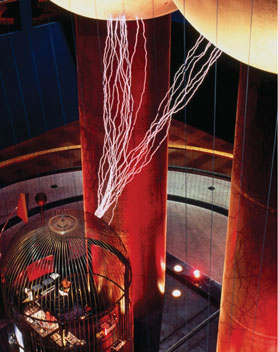
## How can charges move?

---

# Contents
<!-- paginate: skip -->
- Electric Potential and Circuits
- Electric Currents and Circuits
- Ohm’s Law
- Electric Power and Energy Conversion

---
# Key Points from Electromagnetism

**Charge**  Unit: Coulomb (C)

* **Electric Fields**
  - Region where charges experience force
  - Field strength: $E = \frac{F}{q}$
  - Charges in fields have $PE_{electrical}$
  

  |Movement|+q|-q|
  |-:|:-:|:-:|
  |Along Field|$PE ↓$|$PE ↑$|
  |Against Field|$PE ↑$|$PE ↓$|

* **Electric Potential Energy**
  - Energy stored in *charge* within fields
  - Depends on charge separation
  - Measured in Joules (J)
  - $PE = k_C \frac{q_1 \cdot q_2}{r}$

* **Electric Potential (Voltage)**
  - Energy stored in *fields* themselves
  - Energy per unit charge (V)
  - $V = \frac{PE}{q}$

---

# The “Life Force”
<!-- paginate: true -->

**Luigi Galvani (1737–1798)**

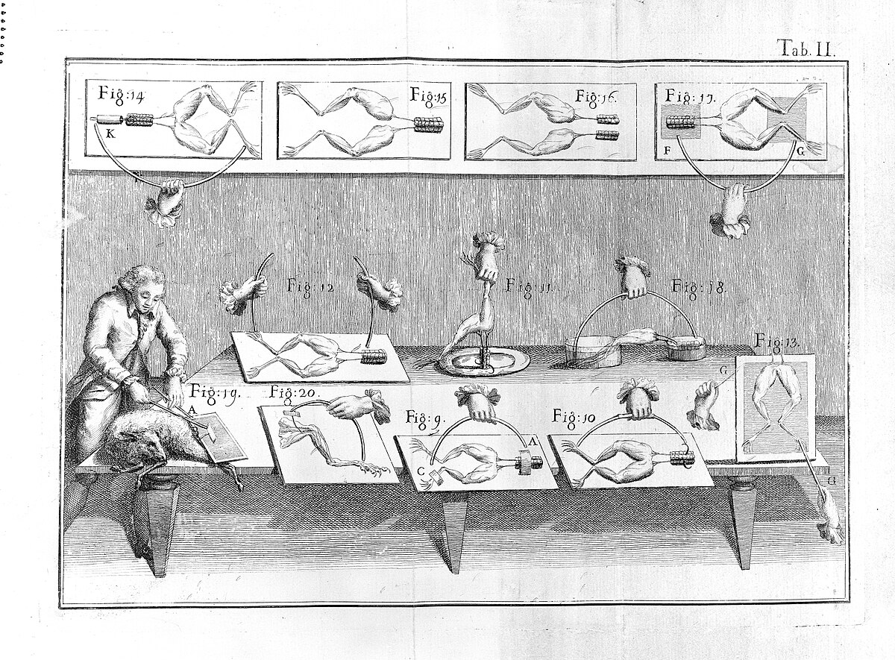

- **1791:** Static electricity causes a frog leg to twitch.
* Twitching also induced by metals.
* Metals thought to conduct the animal's "life force".

---

# Skeptical Interrogation

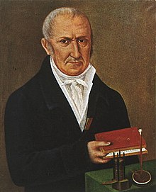

**Alessandro Volta (1745–1827)**

Galvani’s "life force" claim questioned.
* Experiments showed metals were the source of electricity, conducted by frog tissue.
* Debunked idea that electricity is only in living things.

---

# Volta Pile

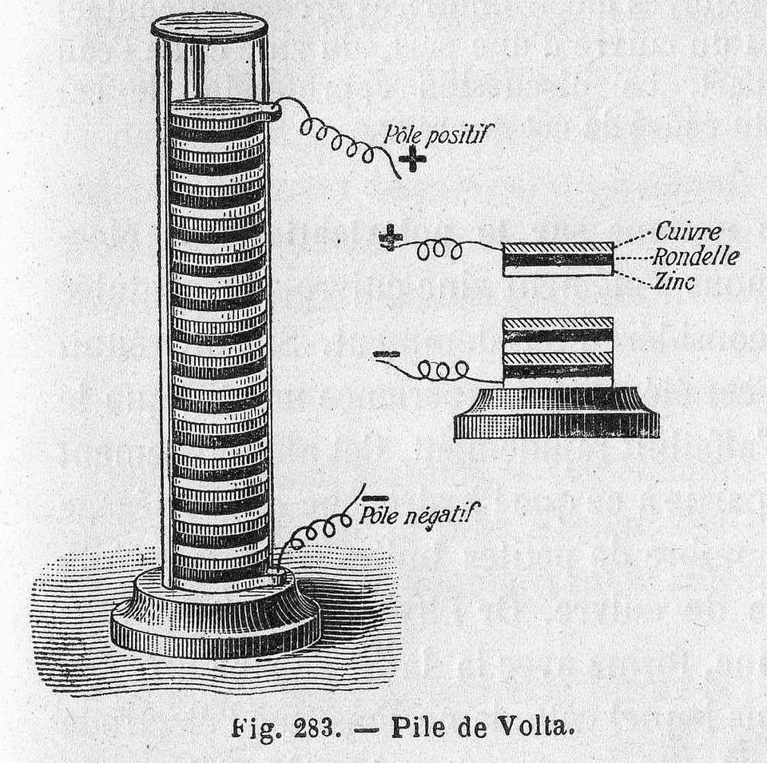

- The first battery, invented by Volta.
- Each layer produced about 0.7 volts of electricity.
- Used alternating discs of zinc and copper separated by cardboard soaked in saltwater.
* Napoleon was so impressed he made Volta a count in 1801.

---

# Electric Batteries

- Batteries convert chemical energy into electrical energy.
- Provide a constant voltage (EMF) to a circuit.
- **Parts:** Anode (−), Cathode (+), Electrolyte.
- **Key Point:** Batteries "push" electrons through the circuit.

---

# Circuit Diagram Norms

- Use standardized symbols (battery, resistor, capacitor etc.)
- Draw straight lines with 90° angles for wires
- Avoid wire crossings where possible; use dots for connections
- Label components with values (V, $\Omega$, etc.)
- Show conventional current flow (+ to -)
- Keep diagrams simple and uncluttered
- Represent resistors and consumers with appropriate symbols:
  - Resistors: zigzag lines for pure resistance
  - Consumers (lamps, motors): specific symbols showing energy conversion

---

# Current Diagram Symbols

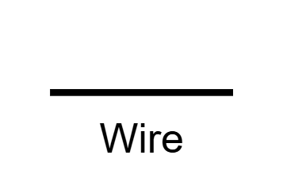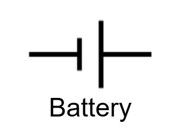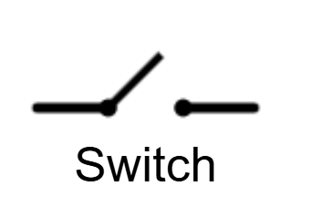

* The longer line indicates the positive terminal; shorter indicates negative
* Open switches prevent electrical energy flow; closed switches permit it

---

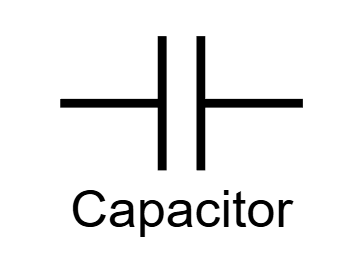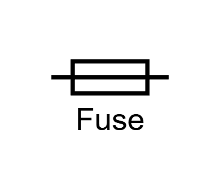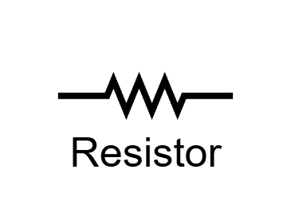

* Capacitors work as batteries except release charge instantly and must be charged again
* Fuses are designed as deliberate fault points to prevent permanent system damage
* Resistors can be anything that consume energy; almost always loss as heat

---

# Electric Current Analogy

* *Charge* flow in a conductor is *like* water in a pipe.
* Charge flows from high to low potential
* Charge spreads to share all paths
* Flow depends on paths available

---

# Electricity and Magnetism

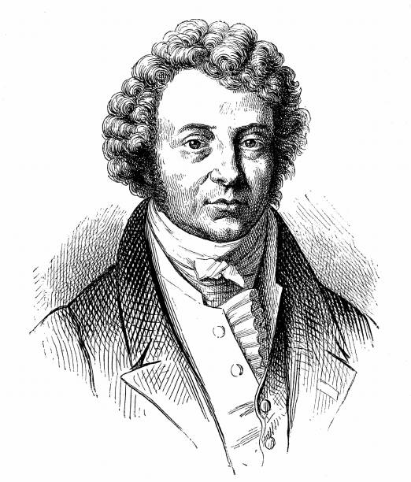

**André-Marie Ampère (1775-1836)**
- Discovered relationship between electricity and magnetism
- Ampere (A): Unit of electric current
  $$1 \text{ ampere} = \frac{1 \text{ coulomb}}{1 \text{ second}} = \frac{\text{charge}}{\text{time}}$$

---
<!--
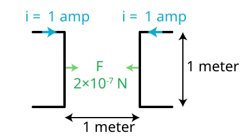

The ampere was defined relative to the force between parallel current-carrying conductors:
- Two conductors 1m apart
- Each carrying 1 ampere
- Experience a force of 2×10⁻⁷ N per meter

---
-->

# Electric Current

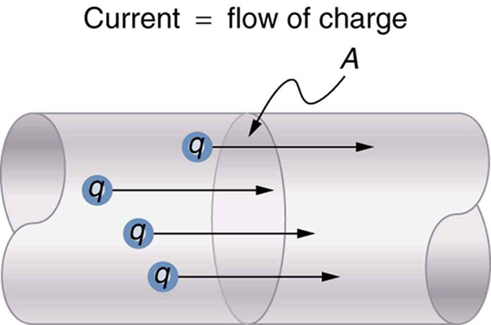

- **Electric current** (**I**) is the flow of electric charge.
* **Not the flow of electrons!**
* Measured in **amperes (A)**.

* $$I = \frac{Q}{t}$$ 
  $$\text{current} = \frac{\text{charge}}{\text{time}}$$

---

# Visualizing the flow of charge

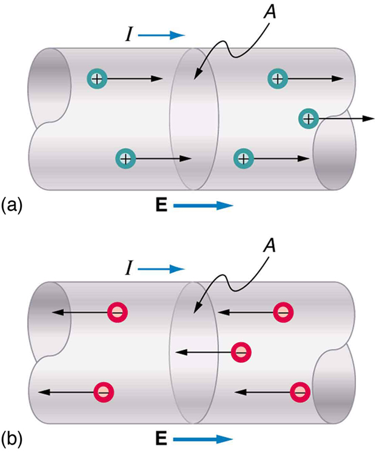

- **Conventional current:** Direction *positive* charges would flow (from + to −).

* - *Charge* is said to flow from the positive to the negative terminal through the circuit
* - Electrons would be visualized moving from the negative toward the positive terminal *against the current*
* - Electrons move very slowly (drift velocity ~1mm/s)

---
# Misconceptions about Electric Current
* Energy transfer in circuits is near light speed (despite drift velocity)
* Like dominoes: push one end, other end falls instantly
* Electrons bump into each other, transferring energy
* Like pushing water in a full pipe: instant flow at other end

---

# Ohm’s Law

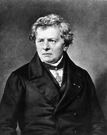

Mathematical relationship between voltage, current, and resistance:

$$V = I \cdot R$$

$$\text{voltage} = \text{current} \times \text{resistance}$$

* The Ohm (Greek Omega, $\Omega$) is the unit of resistance:
  $$1 \Omega = \frac{1 \text{ V}}{1 \text{ A}} \text { or } \text{Ohm} = \frac{\text{Volt}}{\text{Amp}}$$

---
# Simple Ohm's Law Units Example

**Example:** If $V = 9$ V and $R = 3~\Omega$, then $I = 3$ A.

$$
I = \frac{V}{R} = \frac{\text{volts}}{\text{ohms}} = \frac{\text{volts}}{\frac{\text{volts}}{\text{ampere}}} = \cancel{\text{volts}} \times \frac{\text{amperes}}{\cancel{\text{{volts}}}}= \text{amperes}
$$

* $$1 \Omega = \frac{1 \text{ volt}}{1 \text{amp}} \text{ or } \text{resistance} = \frac{\text{voltage drop}}{\text{current}}$$

---

# (Complex) Cancellation to SI Base Units

* For resistance ($\Omega$):

* $$\Omega = \frac{\text{V}}{\text{A}} = \frac{\frac{\text{J}}{\text{C}}}{\frac{\text{C}}{\text{s}}} = \frac{\frac{\text{kg} \cdot \text{m}^2}{\text{s}^2 \cdot \text{C}}}{\frac{\text{C}}{\text{s}}} = \frac{\text{kg} \cdot \text{m}^2}{\text{s}^2 \cdot \text{C}} \cdot \frac{\text{s}}{\text{C}} = \frac{\text{kg} \cdot \text{m}^2}{\text{s}^3 \cdot \text{A}^2}$$

* Therefore, $1~\Omega = 1~\text{kg}\cdot\text{m}^2\cdot\text{s}^{-3}\cdot\text{A}^{-2}$

---

# Resistivity

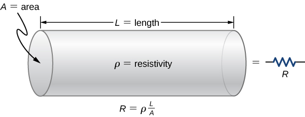

- Resistance depends on material, length, and area.
* The resistivity of a section of circuit is given as:

  $$R = \rho \frac{L}{A}$$

  Where 
    - $\rho$ = resistivity ($\Omega$·m)
    - $L$ = length (m)
    - $A$ = cross-sectional area (m²)

---

# Practical Resistivity

 
  | Material | Resistivity ($\Omega$·m) |
  |----------|------------------|
  | Wood (dry) | $10^{14}$ |
  | Rubber | $10^{13}$ |
  | Glass | $10^{10}$ |
  | Human Skin (dry) | $10^{3}$ |
  | Salt Water | $2.0 \times 10^{-1}$ |
  | Iron | $1.0 \times 10^{-7}$ |
  | Aluminum | $2.8 \times 10^{-8}$ |
  | Copper | $1.7 \times 10^{-8}$ |

**Table 1** Resistivity of common materials.
* One way to think of resistivity is how much energy will be lost as heat as the charge flows through it.
* a) Copper **conducts** the electricity. 
* b) Wood catches **fire**.
* c) Biological tissues experience **burns**

---

# Resistance and Resistors

- **Resistance**: How much a material opposes current flow.
- **Resistors**: Components designed to introduce resistance.
      - Application: convert **electrical** into **thermal** energy

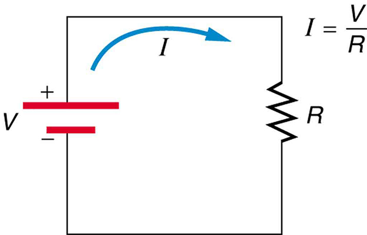

---

# Ohm’s Law in Circuits

<!-- 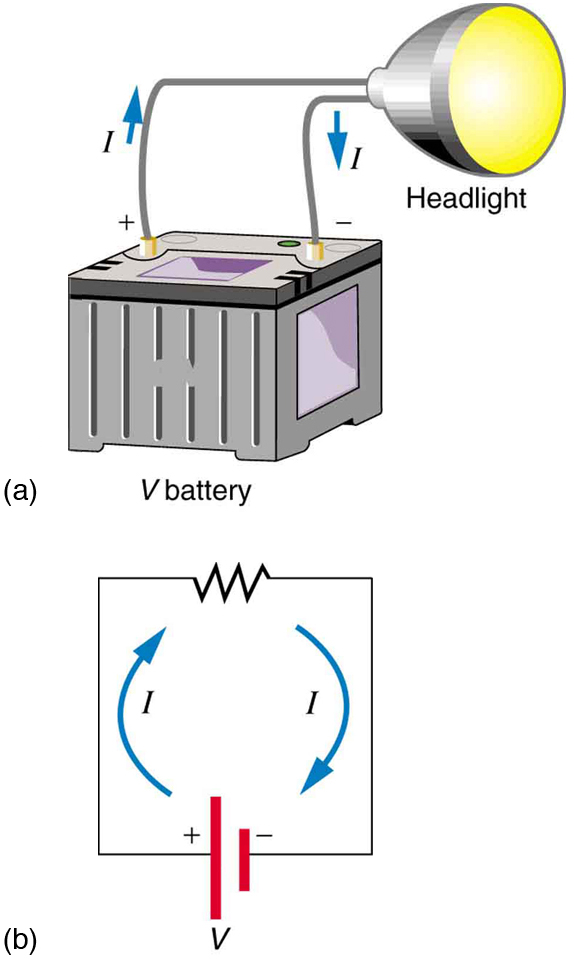 -->

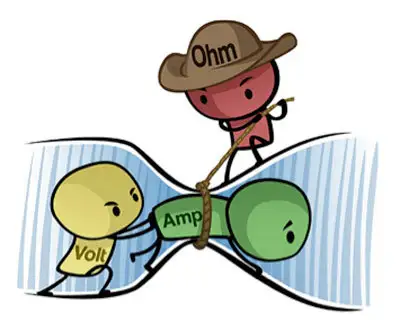

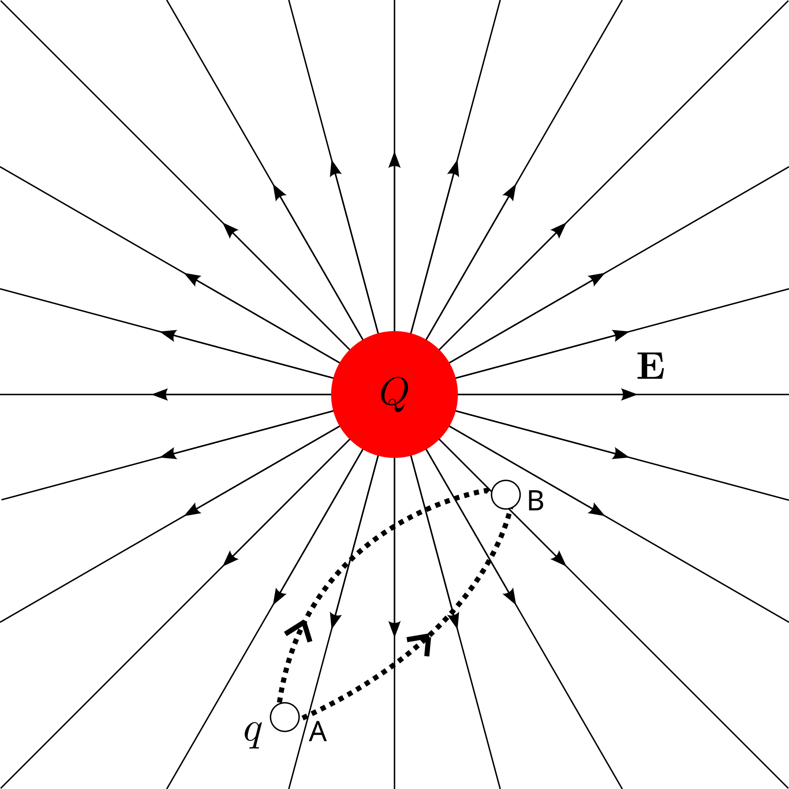

- When current flows through a resistor, a voltage drop is experienced.
- Force on the charge is no longer balanced because one path is energetically "easier" to follow
- Visualize resistance as a narrow pipe or thumb over a hose.

The voltage drop can be calculated using **Ohm's Law**: 
$$V = I R$$

---

# EMF and Terminal Voltage

- **EMF (Electromotive Force):** The ideal voltage a battery provides.

<!-- 
 -->

- **Terminal Voltage:** Actual voltage across battery terminals (can be less than EMF due to internal resistance).

$$V_{terminal} = \text{EMF} - I r$$

Where
  - $I_r$ = internal resistance

---
# Series vs Parallel Circuits

|||
|-|:-:|
|- All resistors are aligned in a single circuit   - The same current exists throughout   - Voltage divides across components   - Higher total resistance|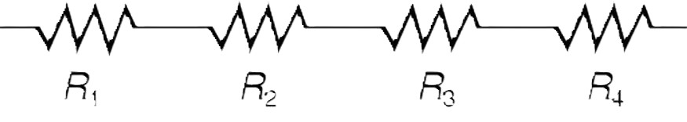|
|- Multiple paths for current   - Current divides between paths   - The same voltage across branches   - Lower total resistance|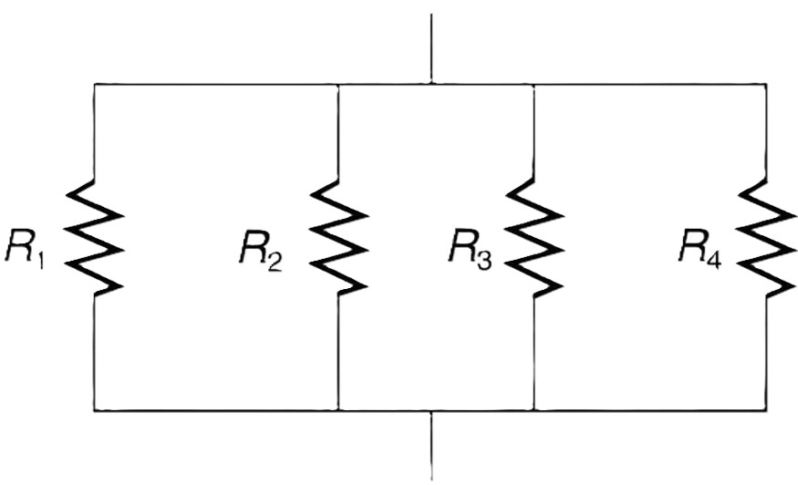|

---

# Series vs Parallel Applications

**Series Circuits**
- Christmas lights (old style)
- Battery-powered devices
- Voltage dividers
- If one breaks, all stop

**Parallel Circuits**
- Home wiring
- Modern Christmas lights
- Multiple device outlets
- If one breaks, others work

---

# Resistors in Series

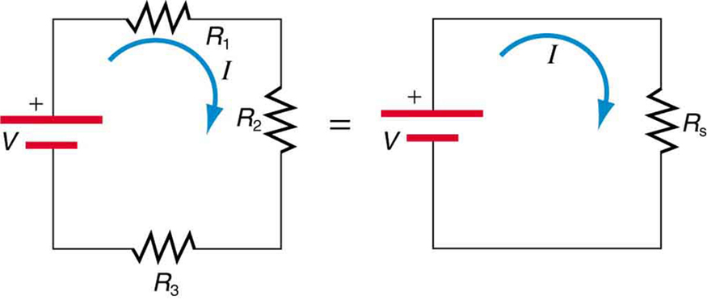

**Resistance in Series Circuits**
Total resistance: $R_{eq} = R_1 + R_2 + \dots$

---

# Resistors in Parallel

 

**Resistance in Parallel Circuits**
Total resistance: $\frac{1}{R_{eq}} = \frac{1}{R_1} + \frac{1}{R_2} + \dots$

---

# Electrical Power

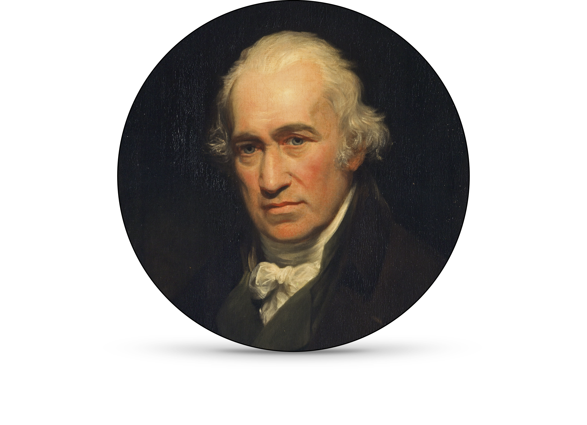

- **Power (P)** is the rate at which energy is transferred
- In circuits, power is energy per unit time $P = \frac{\text{energy}}{\text{time}} = \frac{\text{Joule}}{\text{second}}$
- Measured in watts (W): 
- $1 \text{watt} = \frac{\text{Joule}}{\text{second}}$
- 
<!-- 
 -->

**Power and Work**
$$P = \frac{W}{t} = \frac{F \cdot d}{t} = V \cdot I$$

---

# Energy Connection

<!-- 
 -->

- Work done by electric force: $W = F \cdot d$
      - Work from charge and voltage: $W = q \cdot V$
      - Power from work over time: $P = \frac{W}{t}$
      - Current as charge over time: $I = \frac{q}{t}$
      - Substituting current: $P = \frac{W}{t} = \frac{qV}{t} = V \cdot \frac{q}{t} = V \cdot I$

Therefore:

$$W = q \cdot V = \Delta PE$$
$$P = V \cdot I$$

---

# Converting Units to Energy and Power

* Power (watts) is a measure of energy per second
* 1 watt = 1 joule per second

$$\text{W} = \text{Volts} \cdot \text{Amperes} = \frac{\text{Joules}}{\text{Coulomb}} \cdot \frac{\text{C}}{\text{second}} = \frac{\text{J}}{\text{s}}$$
- $$1 \mathrm{watt} = 1 \frac{\mathrm{Joule}}{\mathrm{second}}$$

- A 100W device uses 100 joules of energy each second
- Total energy = power × time (joules = watts × seconds)

Three equivalent formulae for electrical power:

- $$P = V \cdot I$$
- $$P = I^2 \cdot R$$
- $$P = \frac{V^2}{R}$$

<!-- 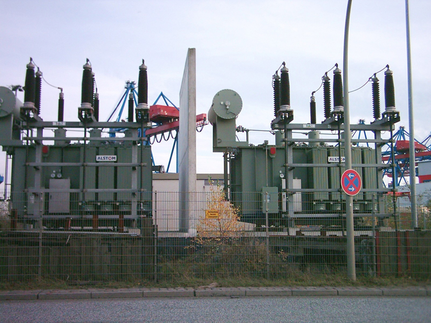 -->

---

# Common Electrical Power Requirements

| Device | Voltage (V) | Power (W) | Notes |
|--------|:------------:|:-----------:|--------|
| iPhone Charger | 5 | 20 | USB-C Power Delivery |
| MacBook Pro | 20 | 140 | Via USB-C/MagSafe |
| Refrigerator | 120 | 150 | Energy-efficient model |
| Gaming PC | 120 | 750 | Under full load |
| Microwave | 120 | 1,000 | Standard household unit |
| Electric Kettle | 120 | 1,500 | Boils water in ~4 minutes |
| Air Conditioner | 240 | 3,500 | Central home unit |
| Tesla Model 3 | 400 | 250,000 | Peak power during acceleration |
| Boeing 787 | 115 | 1,000,000 | Main electrical system |

---
## Problem 1: Series Circuit Analysis
A circuit contains three resistors in series: $R_1 = 3~\Omega$, $R_2 = 6~\Omega$, and $R_3 = 9~\Omega$. If connected to a 12 V battery:

a) What is the total resistance?
b) What is the current through each resistor?
c) What is the voltage drop across each resistor?

---

- a) **Approach**: For resistors in series, add individual resistances.
  $R_{total} = R_1 + R_2 + R_3 = 18~\Omega$

- b) **Approach**: With total resistance known, apply Ohm's law to find current.
  $I = \frac{V}{R} = \frac{12~\text{V}}{18~\Omega} = 0.67~\text{A}$

- c) **Approach**: In series circuits, use Ohm's law to find voltage drop across each resistor.
  $V_1 = 0.67~\text{A} \times 3~\Omega = 2~\text{V}$
  $V_2 = 0.67~\text{A} \times 6~\Omega = 4~\text{V}$
  $V_3 = 0.67~\text{A} \times 9~\Omega = 6~\text{V}$

---

## Problem 2: Power Consumption
A circuit has a 9 V battery connected to a 3 $\Omega$ resistor:

a) What is the current in the circuit?
b) What is the power dissipated by the resistor?
c) How much energy is converted to heat in 5 minutes?

---

**Solution:**
- a) **Approach**: Apply Ohm's law directly to find current.
  $I = \frac{V}{R} = \frac{9~\text{V}}{3~\Omega} = 3~\text{A}$

- b) **Approach**: Use power formula with known current and resistance.
  $P = I^2R = (3~\text{A})^2 \times 3~\Omega = 27~\text{W}$

- c) **Approach**: Convert power to energy by multiplying by time in seconds.
  $E = P \times t = 27~\text{W} \times 300~\text{s} = 8100~\text{J}$

---

## Problem 3: Parallel Circuit
Two resistors are connected in parallel: $R_1 = 4~\Omega$ and $R_2 = 6~\Omega$. If the voltage across them is 12 V:

a) What is the equivalent resistance?
b) What is the total current from the battery?
c) What is the current through each resistor?

---

**Solution:**
- a) **Approach**: For parallel circuits, add the reciprocals of individual resistances, then take the reciprocal of that sum.
  $\frac{1}{R_{eq}} = \frac{1}{4} + \frac{1}{6} = \frac{5}{12}$; $R_{eq} = 2.4~\Omega$

- b) **Approach**: Once you have the equivalent resistance, apply Ohm's law with the total voltage to find total current.
  $I_{total} = \frac{V}{R_{eq}} = \frac{12~\text{V}}{2.4~\Omega} = 5~\text{A}$

- c) **Approach**: In parallel circuits, each component receives the full voltage. Apply Ohm's law to each resistor separately.
  $I_1 = \frac{12~\text{V}}{4~\Omega} = 3~\text{A}$; $I_2 = \frac{12~\text{V}}{6~\Omega} = 2~\text{A}$

---

# Formula Summary

| Concept         | Formula                        | Units      |
|-----------------|:-------------------------------:|------------|
| Current         | $I = \frac{Q}{t}$             | A          |
| Ohm's Law       | $V = I R$                     | V, A, $\Omega$    |
| Power           | $P = V I$                     | W          |
| Series          | $R_{eq} = R_1 + R_2...$          | $\Omega$          |
| Parallel        | $\frac{1}{R_{eq}} = \frac{1}{R_1} + \frac{1}{R_2}...$      | $\Omega$          |
<!-- | Terminal Voltage| $V = \text{EMF} - I r$        | V          | -->
<!-- | Resistivity     | $R = \rho \frac{L}{A}$       | $\Omega$·m        | -->

<!-- fit -->

| Concept                | Formula                                   | Units |
|------------------------:|:---------------------:|:--------|
| Ohm's Law              | $V = I \cdot R$                           | V, A, $\Omega$ |
| Resistance             | $R = \frac{V}{I}$                         | $\Omega$ |
| Power                  | $P = V \cdot I$      $P = I^2 \cdot R$    $P = \frac{V^2}{R}$                       | W |
| Electric Potential     | $V = \frac{PE}{q}$                        | V |

<!-- |Unit|Unit Relationships|
|-|-|
| Resistance (unit)      | $1~\Omega = \frac{1~V}{1~A}$              | 1 Ohm = 1 Volt / 1 Ampere                        |
| Power (unit)           | $1~W = 1~V \cdot 1~A$                     | 1 Watt = 1 Volt × 1 Ampere                       |
| Power (unit)           | $1~W = 1~\frac{J}{s}$                     | 1 Watt = 1 Joule per second                      | -->

