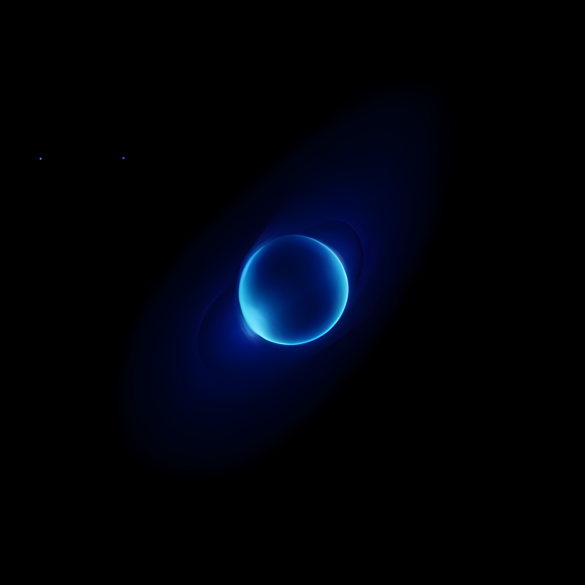
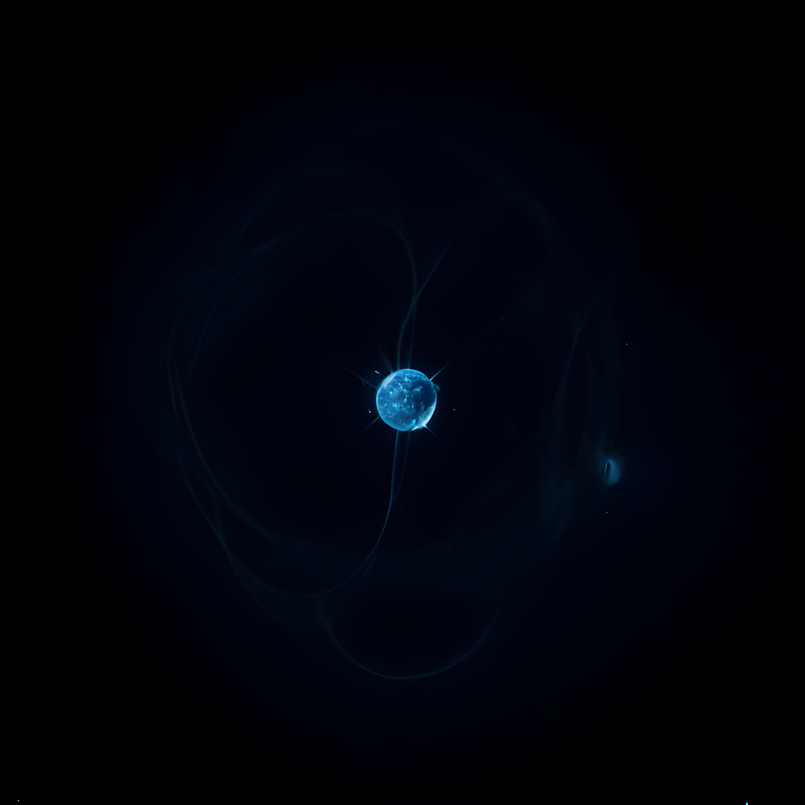

<!-- class: dark -->
## The Universe at a Glance

Modern astrophysics reveals our cosmic context:

+ The observable universe spans 93 billion light-years
+ Contains over 100 billion galaxies
+ Each galaxy hosts billions of stars

---

<!-- _class: light -->
# Stellar Evolution

The life cycle of stars follows predictable patterns:

$$L = 4\pi R^2\sigma T^4$$

Where:
- L is luminosity
- R is radius
- T is surface temperature

---

# Galactic Structure
|||
|-|-|
|Bulge | Dense stellar population at galaxy center |
|Disk | Primary region of star formation |
|Halo | Spherical region of old stars |
|Dark Matter | Invisible mass affecting rotation |

---

<!-- _class: dark -->

## Black Holes

The Schwarzschild radius is given by: 

$R_s = \frac{2GM}{c^2}$

Where:
- G is gravitational constant
- M is mass
- c is speed of light

---

## Cosmological Principles

The universe is:
- Homogeneous
- Isotropic
- Expanding according to:

$$v = H_0d$$

---
<!-- _class: light -->

# Light Header

---
