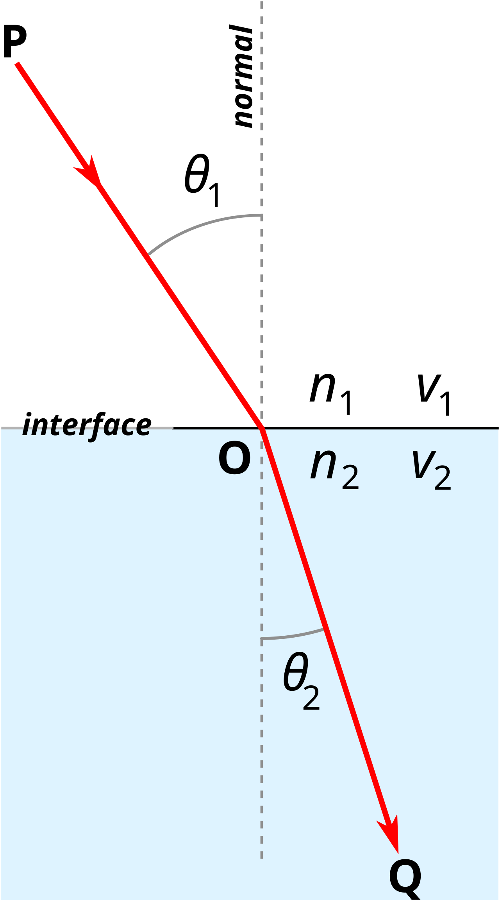

# 10 | Light and Optics

Light is both a wave and a particle, exhibiting behavior that can be described using both geometric optics (ray model) and wave optics. This dual nature makes light one of the most fascinating phenomena in physics. This chapter explores the properties of light, how it interacts with different surfaces and media, and various optical phenomena that arise from these interactions.

## 10.1 Geometric Optics

Geometric optics treats light as rays that travel in straight lines and follows simple rules when interacting with surfaces. This model is particularly useful for understanding mirrors, lenses, and many everyday optical phenomena.

### Characteristics of Light

Light is an electromagnetic wave that can travel through vacuum. Its behavior is governed by some fundamental characteristics:

**Fundamental Properties of Light**
- Speed of light in vacuum: $c = 3.00 \times 10^8$ m/s
- Relationship between wavelength and frequency: $c = f \cdot \lambda$
  - Where $c$ is the speed of light, $f$ is frequency, and $\lambda$ is wavelength
- Light travels in straight lines in a uniform medium
- Illuminance (brightness) decreases as the square of the distance from the source

While light travels at $3.00 \times 10^8$ m/s in vacuum, it slows down when passing through materials. The degree to which light slows in a particular medium is characterized by the medium's index of refraction, which we'll discuss later in this chapter.

### Reflection and Mirrors

When light encounters a boundary between two media, part of it bounces back - this is reflection. Reflection occurs at all surfaces to some degree, but it's most noticeable at smooth, polished surfaces like mirrors.

#### Laws of Reflection

**The Laws of Reflection**
- The incident ray, the reflected ray, and the normal to the surface all lie in the same plane
- The angle of incidence equals the angle of reflection: $\theta = \theta'$
- The incident ray and reflected ray are on opposite sides of the normal

*The angle of incidence $\theta$ equals the angle of reflection ($\theta '$)*

#### Flat Mirrors

Flat mirrors produce virtual images that appear to be behind the mirror. These images have several interesting properties:

- The image is the same size as the object (magnification = 1)
- The image is as far behind the mirror as the object is in front of it
- The image is laterally inverted (left and right are reversed)
- The image is virtual - light rays don't actually pass through it

*Reflection in a flat mirror produces a virtual image behind the mirror*

#### Image Types

Understanding the different types of images is crucial for analyzing optical systems:

**Types of Images**
- **Virtual Image**: A collection of rays that appear to come from a location, but don't actually pass through it. These images cannot be projected onto a screen. (Example: image in a flat mirror)
- **Real Image**: Formed when light rays actually converge at a point. These images can be projected onto a screen. (Example: image formed by a projector on a movie screen)

### Curved Mirrors

Curved mirrors come in two main varieties: concave (curving inward) and convex (curving outward). Their behavior is more complex than flat mirrors but follows predictable patterns.

#### Mirror Equation

The relationship between object distance (p), image distance (q), and focal length (f) is given by the mirror equation:

**Mirror Equation**
$$\frac{1}{p} + \frac{1}{q} = \frac{1}{f}$$

Where:
- p = object distance (distance from object to mirror)
- q = image distance (distance from image to mirror)
- f = focal length (distance from mirror to focal point)

For concave mirrors, the focal length is positive.
For convex mirrors, the focal length is negative.

#### Magnification

The magnification produced by a mirror tells us how much larger or smaller the image is compared to the object:

**Magnification Equation**
$$M = \frac{h'}{h} = -\frac{q}{p}$$

Where:
- M = magnification
- h' = image height
- h = object height
- q = image distance
- p = object distance

If M is positive, the image is upright.
If M is negative, the image is inverted.
If |M| > 1, the image is larger than the object.
If |M| < 1, the image is smaller than the object.

#### Concave Mirrors

Concave mirrors (sometimes called converging mirrors) curve inward like the inside of a spoon. They have a focal point in front of the mirror where parallel rays of light converge after reflection.

Concave mirrors can form both real and virtual images, depending on the object's position:
- When the object is beyond the center of curvature (2f): real, inverted, diminished image
- When the object is at the center of curvature (2f): real, inverted, same size image
- When the object is between the center of curvature and focal point: real, inverted, enlarged image
- When the object is at the focal point (f): no image forms (rays emerge parallel)
- When the object is between focal point and mirror: virtual, upright, enlarged image

*Ray diagram for a concave mirror showing how parallel rays converge at the focal point*

#### Convex Mirrors

Convex mirrors (sometimes called diverging mirrors) c