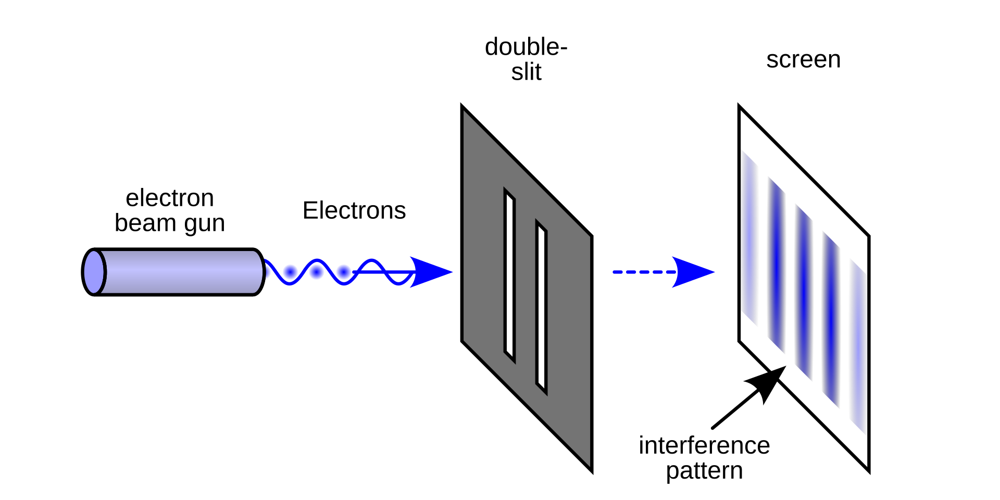

<style>
    .important-info{
        padding: 1rem;
        border: 0.1 pt black solid;
        box-shadow: 5pt grey solid;
    }
</style>

# 8.2 The Dual Nature of Light: Waves, Particles, and Energy

Light is one of the most fascinating phenomena in physics, exhibiting both wave-like and particle-like properties. In this section, you'll learn how experiments reveal the wave nature of light, how energy is quantized in photons, and how to calculate the energy of light.

<iframe width="560" height="315" src="https://www.youtube.com/embed/IRBfpBPELmE?si=v2C181QCQLh5bnDQ" title="YouTube video player" frameborder="0" allow="accelerometer; autoplay; clipboard-write; encrypted-media; gyroscope; picture-in-picture; web-share" referrerpolicy="strict-origin-when-cross-origin" allowfullscreen></iframe>


---

## 1. Light as a Wave

Light travels through space as an electromagnetic wave—oscillating electric and magnetic fields that propagate at the speed of light ($c \approx 3.00 \times 10^8$ m/s in a vacuum).

### Key Properties of Waves

- **Wavelength ($\lambda$):** Distance between consecutive peaks or troughs.
- **Frequency ($f$):** Number of wave cycles passing a point per second (Hz).
- **Amplitude ($A$):** Maximum displacement from equilibrium (related to brightness).

The relationship between wavelength and frequency is:
$$
c = \lambda f
$$

---

## 2. Evidence for the Wave Nature of Light

### Huygens' Principle

Christian Huygens proposed that every point on a wavefront acts as a source of tiny wavelets. The new position of the wavefront is found by drawing a surface tangent to all these wavelets. This principle explains how waves propagate, bend, and interfere.

### Diffraction and Interference

When light passes through narrow slits or around obstacles, it bends and spreads out—a phenomenon called **diffraction**. When two or more light waves overlap, they combine to form patterns of constructive and destructive **interference**.

#### The Double-Slit Experiment

<div class='figure-right'>



</div>

In the famous double-slit experiment, light passing through two closely spaced slits creates an interference pattern of bright and dark bands on a screen. This pattern can only be explained if light behaves as a wave.

- **Constructive interference:** Crests of two waves align, producing a bright fringe.
- **Destructive interference:** Crest of one wave aligns with the trough of another, producing a dark fringe.

#### Single-Slit Diffraction

Light passing through a single slit also produces a diffraction pattern, with a bright central maximum and dimmer bands to the sides. The pattern depends on the slit width and the wavelength of light.

#### The Coin Shadow Phenomenon

If you shine a light on a coin suspended in air, you’ll see a bright spot at the center of its shadow. This surprising result is due to diffraction and constructive interference of light waves bending around the coin’s edge.


---

## 3. Light as a Particle: Photons and Energy Quantization

While light behaves as a wave in many experiments, it also acts as a stream of particles called **photons**. Each photon carries a discrete amount of energy.

### Photon Energy

<div class='important-info'>

**Photon Energy Equation**

$$
E = hf
$$

Where:
- $E$ = energy of a photon (joules, J)
- $h$ = Planck's constant ($6.626 \times 10^{-34}$ J·s)
- $f$ = frequency of the light (Hz)

</div>

Since $c = \lambda f$, photon energy can also be written as:
$$
E = \frac{hc}{\lambda}
$$

- $\lambda$ = wavelength (meters)
- $c$ = speed of light ($3.00 \times 10^8$ m/s)

---

## 4. The Photoelectric Effect

When light shines on certain metals, it can eject electrons from the surface—a phenomenon called the **photoelectric effect**. This effect provided strong evidence for the particle nature of light.

- The kinetic energy of ejected electrons depends on the frequency (not intensity) of the light.
- There is a threshold frequency below which no electrons are ejected, regardless of intensity.

Einstein explained this by proposing that light consists of photons, each with energy $E = hf$. The photoelectric effect equation is:

$$
KE_{max} = hf - \phi
$$

Where:
- $KE_{max}$ = maximum kinetic energy of ejected electrons
- $hf$ = energy of the incident photon
- $\phi$ = work function (minimum energy needed to remove an electron)

This simple and elegant formula solidified a very curious aspect of reality: light can exist with two separate characters **simultaneously**. 

---

## 5. Applications and Modern Technology

Understanding the wave-particle duality of light has led to many technologies:

- **Solar cells:** Convert light energy to electrical energy using the photoelectric effect.
- **Lasers:** Generate coherent light beams through stimulated emission of photons.
- **Photodiodes:** Detect light by converting photons to electrical signals.


---

## 6. Sample Calculations

<!-- Leave space for sample calculations as requested -->
<!-- Example: Calculating photon energy for a given wavelength or frequency -->
### Problem 1: Violet Light
A beam of violet light has a wavelength of 400 nm. 
a) Calculate the energy of a single photon of this light.
b) How does this photon's wave nature explain why you can see diffraction patterns with violet light?

**Solution:**
Using $E = \frac{hc}{\lambda}$
```
E = (6.626 × 10⁻³⁴ J·s)(3.00 × 10⁸ m/s)/(400 × 10⁻⁹ m)
E = 4.97 × 10⁻¹⁹ J
```
The wave nature allows violet light to interfere with itself, creating bright and dark bands in diffraction patterns. The short wavelength creates finer, more closely spaced patterns than red light.

### Problem 2: Radio Waves
A radio station broadcasts at 88.5 MHz. 
a) What is the wavelength of these radio waves?
b) Why can radio waves diffract around buildings but still behave like particles?

**Solution:**
Using $c = \lambda f$
```
λ = c/f
λ = (3.00 × 10⁸ m/s)/(88.5 × 10⁶ Hz)
λ = 3.39 m
```
Radio waves exhibit wave behavior at large scales (diffraction around buildings) while still consisting of discrete photons. This demonstrates wave-particle duality across the electromagnetic spectrum.

### Problem 3: Photoelectric Effect
Light with frequency 7.0 × 10¹⁴ Hz strikes a metal surface with work function 2.0 eV.
a) Will electrons be ejected?
b) How does this demonstrate light's particle nature?

**Solution:**
Using $E = hf$
```
E = (6.626 × 10⁻³⁴ J·s)(7.0 × 10¹⁴ Hz)
E = 4.64 × 10⁻¹⁹ J = 2.9 eV
```
Since photon energy (2.9 eV) > work function (2.0 eV), electrons will be ejected with 0.9 eV kinetic energy. This shows light delivers energy in discrete packets (photons), not as a continuous wave.

---

## 7. Summary

- Light exhibits both wave and particle properties.
- Wave phenomena such as diffraction and interference provide strong evidence for the wave nature of light.
- The energy of light is quantized in photons, with $E = hf$ or $E = \frac{hc}{\lambda}$.
- The photoelectric effect demonstrates the particle nature of light.
- Understanding these concepts allows us to predict and calculate the behavior and energy of light in various situations.

**Key Equations:**
- $c = \lambda f$ (wave equation)
- $E = hf$ (photon energy)
- $E = \frac{hc}{\lambda}$ (photon energy in terms of wavelength)
- $KE_{max} = hf - \phi$ (photoelectric effect)

