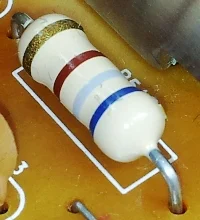

# Understanding Electric Charge and Fields: From Coulomb's Law to Field Energy

Electric charge is one of the fundamental properties of matter, giving rise to many of the phenomena we observe in the natural world and utilize in technology. This tutorial explores the nature of electric charge, how charges interact through Coulomb's law, the concept of electric fields, and the energy stored within these fields.
<iframe width="560" height="315" src="https://www.youtube.com/embed/TFlVWf8JX4A?si=wckm3TYLgAnLU7Ne" title="YouTube video player" frameborder="0" allow="accelerometer; autoplay; clipboard-write; encrypted-media; gyroscope; picture-in-picture; web-share" referrerpolicy="strict-origin-when-cross-origin" allowfullscreen></iframe>

## The Nature of Electric Charge

Electric charge is a fundamental property of matter, similar to mass, but with some important differences:

- **Types of Charge**: Unlike mass, charge comes in two varieties: positive and negative
- **Quantization**: Charge occurs in discrete amounts, with the electron carrying the smallest naturally occurring charge
- **Conservation**: The total charge in an isolated system remains constant
- **Carriers**: Electrons (negative) and protons (positive) are the most common charge carriers

**Elementary Charge Constant:**  
The smallest unit of electric charge is the elementary charge,  
$e = 1.602 \times 10^{-19}$ coulombs.

In everyday objects, charges can be transferred through processes like friction (static electricity), separated through chemical reactions (batteries), or moved through conductors (electric current).

*Induction occurs when charges are temporarily isolated (a) before attaching a ground (b). The ground allows charge of one type to escape, resulting in an isolated charge. If no ground is attached (c) the temporary isolation reverts when the isolating charge is removed (d).*

## Coulomb's Law: The Force Between Charges

In 1785, Charles-Augustin de Coulomb discovered the mathematical relationship governing the force between two charged objects. Coulomb's law states:

**Coulomb's Law:**  
The force between two charged objects is:
- Directly proportional to the product of their charges
- Inversely proportional to the square of the distance between them
- Attractive for opposite charges, repulsive for like charges

Mathematically:  
$F = k \frac{|q_1 q_2|}{r^2}$,  
where $k = 8.99 \times 10^9$ N·m²/C² (Coulomb's constant)

As a simple illustration, if you double the charge on one object, the force doubles. If you halve the distance between charges, the force becomes four times stronger. This relationship follows the same mathematical pattern as Newton's law of gravitation, but with some key differences:

- Electric forces can be attractive or repulsive
- Electric forces are vastly stronger than gravitational forces (approximately 10^36 times stronger for electrons and protons)

This powerful interaction between charges is what allows atoms to hold together and form molecules, and ultimately, all matter.

## The Electric Field Concept

While Coulomb's law describes the direct interaction between charges, the electric field concept provides a more powerful way to understand how charges influence space around them.

### What is an Electric Field?

*Fields can be visualized as arrows showing the direction of the field. In these electric fields, the arrows show the direction of acceleration of a test charge, $q_0$, which is always positive. Thus, the charge would accelerate away from the positive charge (a) and toward the negative charge (b).*

An electric field is a region of space where an electric charge will experience a force. It can be visualized as:

- An alteration of space surrounding a charge
- A property that exists at every point in space
- A way of describing how one charge influences another without direct contact

The electric field concept was developed by Michael Faraday in the 19th century and provides a more intuitive way to understand electric and magnetic interactions than action-at-a-distance forces.

<iframe width="560" height="315" src="https://www.youtube.com/embed/mdulzEfQXDE?si=t5K63Laiz8AbvOW4" title="YouTube video player" frameborder="0" allow="accelerometer; autoplay; clipboard-write; encrypted-media; gyroscope; picture-in-picture; web-share" referrerpolicy="strict-origin-when-cross-origin" allowfullscreen></iframe>

### Electric Field of a Point Charge

A single point charge creates an electric field that:
- Radiates outward in all directions
- Gets weaker with distance (following the inverse square relationship)
- Points away from positive charges and toward negative charges

We can visualize electric fields using field lines - imaginary lines that show the direction a positive test charge would move if placed in the field. The density of these lines indicates the field strength.

## Electric Field Patterns

Different charge arrangements create distinctive field patterns:

- **Point Charge**: Field lines radiate equally in all directions
- **Two Like Charges**: Field lines repel each other, creating a pattern that pushes outward
- **Two Unlike Charges**: Field lines connect the charges, creating an attractive pattern
- **Dipole** (positive and negative charge pair): Field lines flow from positive to negative, creating a characteristic pattern found in many molecules
- **Uniform Field**: Field lines that are parallel and equally spaced, found between charged plates

These patterns help us understand how charges will influence other charges placed in their vicinity.

*Here, two fields are shown overlapping. The strength of the field lines is indicated by the closeness of the lines (closer lines indicating stronger fields). The direction of acceleration of a test charge $q_0$ indicates field direction.*

## Electric Potential and Voltage

*Analogy of gravitational and electric fields. A mass (a) requires work to be lifted a distance out of an attractive gravitational field. Thus its potential energy at a height $h$ is greater than at the ground. Similarly, 2 charges (b) change potential energy when pushed a distance toward a like-charged field. Releasing the stones would return the energy stored in the field to the stones as kinetic energy; releasing the charges in the electric field would release the energy stored in the field as kinetic energy of the charged particles.*

**Electric Potential (Voltage):**  
The electric potential per unit charge at a point in space.  
$V = \frac{U}{q}$

The units of electric potential are $\frac{Joules}{Coulomb}$ ($\frac{J}{C}$), more commonly known as a **volt** (V)

Voltage is measured in volts (V) and represents how much energy a charge would gain or lose by moving between two points. This concept is crucial for understanding:

- Batteries (which maintain a potential difference)
- Electrical circuits (where potential differences drive current)
- Capacitors (which store energy as a separation of charge)

---

<iframe width="560" height="315" src="https://www.youtube.com/embed/ZrMltpK6iAw?si=RxL8tIMMGymxQIVo" title="YouTube video player" frameborder="0" allow="accelerometer; autoplay; clipboard-write; encrypted-media; gyroscope; picture-in-picture; web-share" referrerpolicy="strict-origin-when-cross-origin" allowfullscreen></iframe>

> Focus on the first ~75% of this video - we will limit our discussion to the basics of capacitance without dialectrics or integrations.

  
Imagine a positive test charge moving between the plates of a capacitor. The uniform electric field between the plates exerts a constant force on the charge, pushing it toward the negative plate. If you move the charge from the positive to the negative plate, the electric field does work on it, and this work is stored as electric potential energy. The amount of work done per unit charge is the electric potential difference, or voltage, between the plates. This is why voltage is measured in joules per coulomb (volts). Equipotential lines—lines where the potential is constant—run parallel to the plates and are always perpendicular to the electric field. In a capacitor, these lines help us visualize how the potential changes from one plate to the other.

Just as a ball held above the ground has gravitational potential energy, a charged object in an electric field has electric potential energy. The **difference** in potential energy per unit charge between two points is the **voltage**, and it determines how much **work** the field can do on a charge moving between those points. 

## Energy Stored in Electric Fields

One of the most profound concepts in electromagnetism is that energy can be stored in the electric field itself. When charges are separated against their natural attraction (like charges on opposite plates of a capacitor), energy is stored in the resulting electric field.

  
A capacitor is a device that stores energy by separating charges onto two plates, creating an electric field between them. The energy stored in a capacitor is electric potential energy, just like the gravitational potential energy of a lifted object. When a battery is connected to a capacitor, it moves charge from one plate to the other, building up a voltage across the plates. The amount of energy stored depends on the amount of charge, the voltage, and the geometry of the plates. The closer the plates and the larger their area, the more charge (and thus energy) the capacitor can store. The energy is actually stored in the electric field between the plates, and can be released rapidly—like in a defibrillator, which uses a capacitor to deliver a life-saving jolt of energy.

When work is done to separate charges:
1. Energy is required to overcome the attractive forces
2. This energy doesn't disappear but is stored in the field
3. The energy can later be released when the charges are allowed to move back together

The energy stored in a capacitor can be calculated as 
$$PE_{e} = \frac{1}{2} C V^2$$
- where $C$ is the capacitance
- $V$ is the voltage.

  
Capacitance is a measure of how much charge a capacitor can store for a given voltage. It depends on the size, shape, and separation of the plates, as well as the material between them (the dielectric). Inserting a dielectric increases the capacitance, allowing more energy to be stored for the same voltage. This is why capacitors are so useful in electronics and medical devices—they can store and release energy quickly and efficiently.

**Energy Stored in an Electric Field:**  
The energy stored in an electric field is proportional to:
- The square of the field strength
- The volume occupied by the field

Mathematically:  
$PE_{e} = \frac{1}{2} \epsilon_0 E^2$  
where $PE_{e}$ is energy density, $\epsilon_0$ is the permittivity of free space, and $E$ is the electric field strength.

This stored energy explains why:
- Capacitors can release energy quickly when discharged
- Lightning releases enormous energy as the atmosphere's electric field collapses
- Electric and magnetic field energy can propagate through space as electromagnetic waves

## Practical Applications of Electric Fields and Energy Storage

The concepts of electric charge, fields, and energy storage form the foundation for numerous technologies:

- *Capacitors*
  - Store energy in electric fields between charged plates
  - Can release this energy rapidly when needed
  - Used in camera flashes, defibrillators, and electronic filters

- *Electrostatic Precipitators*
  - Use electric fields to remove particles from gases
  - Applied in air pollution control and industrial processes

- *Photocopiers and Laser Printers*
  - Use static electricity and electric fields to attract toner to paper

- *Electric Field Sensors*
  - Detect the presence and strength of electric fields
  - Used in security systems and scientific instruments

- *Energy Storage Systems*
  - Batteries utilize the energy of separated charges
  - Supercapacitors store energy directly in electric fields

## Visualizing Energy in Fields

One helpful way to understand field energy is to imagine that every region of space containing an electric field has an energy density. Where the field is stronger, the energy density is higher. This visualization helps explain:

- Why capacitors with smaller separation between plates store more energy
- How energy can be transmitted through space without a physical medium
- Why electric fields can exert forces on charged objects

---

These problems help students apply the concepts of charge, force, field, potential, and energy in quantitative and visual ways.

## Summary

Electric charge is a fundamental property of matter that creates electric fields in the surrounding space. These fields exert forces on other charges according to Coulomb's law - a relationship that shows how the force depends on the charges and the distance between them. 

The electric field concept provides a powerful way to visualize and calculate how charges influence each other across space. Perhaps most remarkably, these fields aren't just mathematical tools but physical entities that store energy. This stored energy explains numerous natural phenomena and enables many of our most important technologies.

**Key Concepts to Remember:**
- Electric charges come in two types (positive and negative) that attract or repel each other
    - Coulomb's law describes the force between charges, varying with the product of charges and inversely with distance squared
- Electric fields describe how charges influence space around them
    - These fields contain energy, particularly where field strength is high
  

<iframe src="https://docs.google.com/forms/d/e/1FAIpQLSf0VhBGI9aoC9CdVsPEOfEtPTa6xMldWA5Wj3usXL437ri8kA/viewform?embedded=true" width="640" height="596" frameborder="0" marginheight="0" marginwidth="0">Loading…</iframe>

