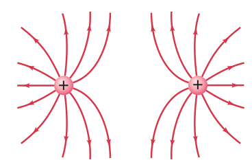

# PS 8.2 | Electric Field and Charge

## Problems

Q1. A point charge of +3.0 μC is placed at the origin.  
(a) What is the magnitude and direction of the electric field 25 cm away from the charge along the x-axis?  
(b) Explain what the direction of the electric field tells you about the force a positive test charge would experience at that point.

**Parent formula:**  
$E = k \frac{|q|}{r^2}$

**Substitute values:**  
$k = 8.99 \times 10^9~\text{N}\cdot\text{m}^2/\text{C}^2$  
$q = 3.0~\mu\text{C} = 3.0 \times 10^{-6}~\text{C}$  
$r = 25~\text{cm} = 0.25~\text{m}$

(a)  
$E = (8.99 \times 10^9~\text{N}\cdot\text{m}^2/\text{C}^2) \frac{3.0 \times 10^{-6}~\text{C}}{(0.25~\text{m})^2}$

$E = (8.99 \times 10^9~\text{N}\cdot\text{m}^2/\text{C}^2) \frac{3.0 \times 10^{-6}~\text{C}}{0.0625~\text{m}^2}$

$E = (8.99 \times 10^9~\text{N}\cdot\text{m}^2/\text{C}^2) \times 4.8 \times 10^{-5}~\text{C}/\text{m}^2$

$E = 4.3 \times 10^5~\text{N/C}$

**Direction:** Away from the charge along the x-axis.

(b)  
The electric field direction shows the force direction on a positive test charge: away from positive, toward negative.

Q2. Two charges, +2.0 μC and -2.0 μC, are placed 40 cm apart on the x-axis.  
(a) Calculate the net electric field at a point exactly midway between them.  
(b) If both charges were positive, how would the direction and magnitude of the net electric field at the midpoint change? Explain.

**Parent formula:**  
$E = k \frac{|q|}{r^2}$  
$E_{net} = E_1 + E_2$ (vector sum)

**At midpoint:**  
Distance from each charge: $r = 0.20~\text{m}$  
$k = 8.99 \times 10^9~\text{N}\cdot\text{m}^2/\text{C}^2$  
$q_1 = +2.0~\mu\text{C} = 2.0 \times 10^{-6}~\text{C}$  
$q_2 = -2.0~\mu\text{C} = -2.0 \times 10^{-6}~\text{C}$

(a)  
$E_1 = (8.99 \times 10^9~\text{N}\cdot\text{m}^2/\text{C}^2) \frac{2.0 \times 10^{-6}~\text{C}}{(0.20~\text{m})^2}$

$E_1 = (8.99 \times 10^9~\text{N}\cdot\text{m}^2/\text{C}^2) \frac{2.0 \times 10^{-6}~\text{C}}{0.04~\text{m}^2}$

$E_1 = (8.99 \times 10^9) \times 5.0 \times 10^{-5}~\text{N/C}$

$E_1 = 4.5 \times 10^5~\text{N/C}$

$E_2 = (8.99 \times 10^9~\text{N}\cdot\text{m}^2/\text{C}^2) \frac{2.0 \times 10^{-6}~\text{C}}{0.04~\text{m}^2} = 4.5 \times 10^5~\text{N/C}$ (opposite direction)

Since the fields are equal and opposite, $E_{net} = 0~\text{N/C}$

(b)  
If both charges were positive, the fields would add at the midpoint, pointing away from each charge, resulting in a nonzero field.

Q3. Three point charges are arranged at the corners of an equilateral triangle (side 0.50 m): +4.0 μC at A, +4.0 μC at B, and -4.0 μC at C.  
(a) Find the magnitude and direction of the net electric field at the center of the triangle.  
(b) Why does the symmetry of the arrangement affect the direction of the net electric field at the center?

**Parent formula:**  
$E = k \frac{|q|}{r^2}$

**Distance from center to vertex:**  
$r = \frac{a}{\sqrt{3}} = \frac{0.50~\text{m}}{\sqrt{3}} = 0.289~\text{m}$

$k = 8.99 \times 10^9~\text{N}\cdot\text{m}^2/\text{C}^2$  
$q = 4.0~\mu\text{C} = 4.0 \times 10^{-6}~\text{C}$

(a)  
$E_{vertex} = (8.99 \times 10^9~\text{N}\cdot\text{m}^2/\text{C}^2) \frac{4.0 \times 10^{-6}~\text{C}}{(0.289~\text{m})^2}$

$E_{vertex} = (8.99 \times 10^9) \frac{4.0 \times 10^{-6}}{0.0835}$

$E_{vertex} = (8.99 \times 10^9) \times 4.79 \times 10^{-5}~\text{N/C}$

$E_{vertex} = 4.3 \times 10^5~\text{N/C}$

By symmetry, the two positive charges' fields partially cancel, and the net field points toward the negative charge. The total field is $8.0 \times 10^5~\text{N/C}$ toward the negative charge.

(b)  
The symmetry means the fields from the positive charges partially cancel, so the net field points toward the negative charge.

Q4. A charge of -6.0 μC is located 30 cm from a point P.  
(a) What is the electric potential at point P due to this charge?  
(b) How much work is required to bring a +1.0 μC charge from infinity to point P?  
(c) Is electric potential a vector or a scalar? How does this affect how you combine potentials from multiple charges?

**Parent formula:**  
$V = k \frac{q}{r}$  
$PE = qV$

$k = 8.99 \times 10^9~\text{N}\cdot\text{m}^2/\text{C}^2$  
$q = -6.0~\mu\text{C} = -6.0 \times 10^{-6}~\text{C}$  
$r = 0.30~\text{m}$

(a)  
$V = (8.99 \times 10^9~\text{N}\cdot\text{m}^2/\text{C}^2) \frac{-6.0 \times 10^{-6}~\text{C}}{0.30~\text{m}}$

$V = (8.99 \times 10^9) \times -2.0 \times 10^{-5}~\text{V}$

$V = -1.8 \times 10^5~\text{V}$

(b)  
$PE = (1.0 \times 10^{-6}~\text{C})(-1.8 \times 10^5~\text{V}) = -0.18~\text{J}$

(c)  
Electric potential is a scalar, so potentials from multiple charges are added algebraically (not as vectors).

Q5. A parallel plate capacitor has a capacitance of 8.0 μF and is charged to a potential difference of 15 V.  
(a) Calculate the energy stored in the capacitor.  
(b) What happens to the energy stored in a capacitor if the voltage is doubled? Explain why.

**Parent formula:**  
$U = \frac{1}{2}CV^2$

$C = 8.0~\mu\text{F} = 8.0 \times 10^{-6}~\text{F}$  
$V = 15~\text{V}$

(a)  
$U = \frac{1}{2}(8.0 \times 10^{-6}~\text{F})(15~\text{V})^2$

$U = 0.5 \times 8.0 \times 10^{-6} \times 225~\text{V}^2$

$U = 4.0 \times 10^{-6} \times 225~\text{J}$

$U = 9.0 \times 10^{-4}~\text{J}$

(b)  
If voltage is doubled, stored energy increases by a factor of four (since $U \propto V^2$).

Q6. The plates of a parallel plate capacitor are moved farther apart while keeping the charge constant.  
(a) Using the formula $U = \frac{1}{2}\frac{Q^2}{C}$, explain what happens to the energy stored in the capacitor as the plates are moved farther apart (with $Q$ constant). Show your reasoning.  
(b) Why does the electric field between the plates remain constant even as the plates are moved apart (with constant charge)?

**Parent formula:**  
$E = \frac{\sigma}{\epsilon_0}$ (for ideal plates, $E$ depends only on charge and area)  
$V = \frac{Q}{C}$  
$U = \frac{1}{2}\frac{Q^2}{C}$

(a)  
As the plates are moved apart (with $Q$ constant):
- $E$ remains constant (depends only on charge and area)
- $C$ decreases (capacitance decreases as distance increases)
- $V$ increases (since $V = Q/C$ and $C$ decreases)
- $U$ increases (since $U = \frac{1}{2}\frac{Q^2}{C}$ and $C$ decreases)

(b)  
The field depends only on charge and plate area, not separation (for ideal parallel plates).

Q7. Sketch the electric field lines and equipotential surfaces for a system of two equal but opposite charges separated by a small distance (an electric dipole).  
(a) Describe the pattern and explain the relationship between field lines and equipotentials.  
(b) How would the field pattern change if both charges were positive?

(a)  
Field lines emerge from the positive charge and enter the negative charge; equipotentials are perpendicular to field lines and crowd near the charges.

(b)  
If both charges were positive, field lines would repel and not connect between charges.

Q8. A small test charge is placed near a large, positively charged *conducting* sphere.  
(a) Describe and explain the direction of the electric field and the force experienced by the test charge both outside and inside the sphere.  
(b) Why is the electric field inside a conductor zero in electrostatic equilibrium?

(a)  
**Outside:** The electric field points radially outward from the surface of the sphere. The force on a positive test charge is also radially outward (repulsive).  
**Inside:** The electric field is zero, so the force on the test charge is zero.

(b)  
The field inside a conductor is zero because charges redistribute to cancel any internal field.

---