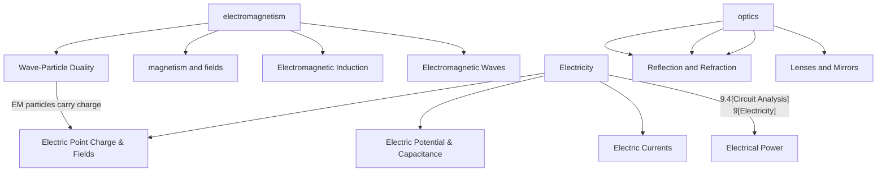

<!-- src/hphys/h_phys_landing --> 

[8 Electromagnetism](#unit-8--electromagnetism)
[9 Electricity](#unit-9--electricity)
[10 Optics](#unit-10--optics)

# Honors Physics
## Branford High School - 2025

---
<section>

## Unit 1 | Principles of Physics

<<<<<<< HEAD
## Unit 3 | Kinematics 2

## Unit 4 | Dynamics

## Unit 5 | Work and Energy

## Unit 6 | Rotational Motion and Gravitation

## Unit 7 | Waves and Harmonics

=======
</section>

<section>

## Unit 2 | Kinematics 1

[PS 2.2 Vectors](1_mechanics/2.2_vectors.md)

</section>

<section>

## Unit 3 | Kinematics 2

- Lecture - Kinematics in Two Dimensions
- Problem Sets
  - PS 3.1 Kinematics in 2 Dimensions
  - PS 3.2 Relative Motion Problems

## Unit 4 | Dynamics
- Newton's Laws
- Forces and Free Body Diagrams

[Lecture - Forces and Newton's Laws](../../slides/hlec_4.1_newton_laws.html)
[PS 4.1 - Force and Motion](../../problem_sets/ps4.1_force_motion.md)
[PS 4.2 - Free Body Diagrams](../../problem_sets/ps4.2_fbd.md)

*Giancoli Ch 4: pp 75-97*

</section>

<section>

## Unit 5 | Work and Energy
- Work-Energy Theorem
- Conservation of Energy
- Power

[Lecture - Work and Energy](../../slides/hlec_5.1_work_energy.html)
[PS 5.1 - Work and Energy](../../problem_sets/ps5.1_work_energy.md)
[PS 5.2 - Conservation of Energy](../../problem_sets/ps5.2_cons_energy.md)

*Giancoli Ch 6: pp 138-164*

</section>

<section>

## Unit 6 | Rotational Motion and Gravitation

|Topic|Resource|
|-:|:-|
|Uniform Circular Motion|Lecture   PS 5.1 - Uniform Circular Motion   Giancoli Problems - UCM   Lab - Uniform Circular Motion|
|Universal Gravitation|Lab - Gravity and Orbits Simulation   [Problem Set - Scientific Notation Practice](1_mechanics/ps1.5_sci_not_practice.md)   [Problem Set - Universal Gravitation](6_circ_grav/PS5.3_univ_grav.md)   [Key - PS5.3](6_circ_grav/ps5.3_univ_grav_key.md)|
|Kepler's Laws and Orbits|Lecture   PS 8.4 Kepler's Laws of Motion   Giancoli Problems|

</section>

<section>

## Unit 7 | Waves and Harmonics

  

    - Lectures
      - [Slides - SHM](8_waves/slides_8_shm.md)
      - [Lecture 8.2 Waves](8_waves/hphys_8_waves_lecture.md)
  

  

    - Problem Sets
 
- [8.1 SHM Springs and Pendula](8_waves/PS_8.1_Harmonics_Springs_Pendula.md)
- [8.2 SHM Waves](8_waves/PS_8.2_Waves.md)

  

</section>

<section>

>>>>>>> 8cfd9bf1f76fea6fa2d1ab5e7069707415b3f701
## Unit 8 | Electromagnetism

### Electrostatics

#### 8.1 Magnetism and Fields
#### 8.2 Electromagnetic Induction
[text](8_electromagnetism/ps_8.2_waves.md)
### Electricity

#### 8.3 Electromagnetic Waves

PS 8.3 

#### 8.4 Wave-Particle Duality

### Problem Sets
- [PS 8.1 - Electrostatics](../../problem_sets/ps8.1_electrostatics.md)
- [PS 8.2 - Electromagnetism](../../problem_sets/ps8.2_electromagnetism.md)

### Lectures
- [Lecture - Electrostatics](../../slides/hlec_8.1_electrostatics.html)
- [Lecture - Electromagnetism](../../slides/hlec_8.2_electromagnetism.html)

*Giancoli Ch 16-20: pp 446-576*

</section>

<section>

## Unit 9 | Electricity 

## Electrostatics

### 9.1 Electric Point Charge & Fields

- Coulomb's Law
  

<<<<<<< HEAD
=======
### Chapter 11
>>>>>>> 8cfd9bf1f76fea6fa2d1ab5e7069707415b3f701

|Section|Problems|
|-:|:-|
|16-5 & 16-6   Coulomb's Law|1, 2, 3, 6, 13*   2) 3.00x1014 electrons  6) 2.7 N  ** In 13, the charge Q is distributed between the two spheres; they each have a charge Q|
|16-7 & 16-8  Electric Fields and Field Lines|19,21,23|

### 9.2 Electric Potential & Capacitance

## Electricity

### 9.3 Electric Currents
### 9.4 Circuit Analysis
### 9.5 Electrical Power

</section>

<section>

## Unit 10 | Optics

### Lectures
- [Optics Lecture](optics/optics_lecture)
- [Rays and Mirrors Lecture](optics/rays_mirrors_lecture)

### Problem Sets
- [PS 10.1 Geometric Optics](../q4-2025/ps10.1_geometric_optics)
- [PS 10.2 | Wave Optics](../q4-2025/ps10.2_wave_optics)

### Electromagnetism Resources
- [Lecture 9 | Electromagnetism](../q4-2025/lecture9_electromagnetism)
- [9.1 Electromagnetism](../q4-2025/ps9.1_electromagnetism)
- [9.1 Electrostatics](../q4-2025/ps9.1_electrostatics)
