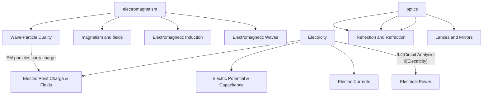

<!-- src/hphys/h_phys_landing --> 

[8 Electromagnetism](#unit-8--electromagnetism)
[9 Electricity](#unit-9--electricity)
[10 Optics](#unit-10--optics)

# Honors Physics
## Branford High School - 2025

---
<section>

## Unit 1 | Principles of Physics

## Unit 3 | Kinematics 2

## Unit 4 | Dynamics

## Unit 5 | Work and Energy

## Unit 6 | Rotational Motion and Gravitation

## Unit 7 | Waves and Harmonics

## Unit 8 | Electromagnetism

### Electrostatics

#### 8.1 Magnetism and Fields
#### 8.2 Electromagnetic Induction
[text](8_electromagnetism/ps_8.2_waves.md)
### Electricity

#### 8.3 Electromagnetic Waves

PS 8.3 

#### 8.4 Wave-Particle Duality

### Problem Sets
- [PS 8.1 - Electrostatics](../../problem_sets/ps8.1_electrostatics.md)
- [PS 8.2 - Electromagnetism](../../problem_sets/ps8.2_electromagnetism.md)

### Lectures
- [Lecture - Electrostatics](../../slides/hlec_8.1_electrostatics.html)
- [Lecture - Electromagnetism](../../slides/hlec_8.2_electromagnetism.html)

*Giancoli Ch 16-20: pp 446-576*

</section>

<section>

## Unit 9 | Electricity 

## Electrostatics

### 9.1 Electric Point Charge & Fields

- Coulomb's Law
  

|Section|Problems|
|-:|:-|
|16-5 & 16-6   Coulomb's Law|1, 2, 3, 6, 13*   2) 3.00x1014 electrons  6) 2.7 N  ** In 13, the charge Q is distributed between the two spheres; they each have a charge Q|
|16-7 & 16-8  Electric Fields and Field Lines|19,21,23|

### 9.2 Electric Potential & Capacitance

## Electricity

### 9.3 Electric Currents
### 9.4 Circuit Analysis
### 9.5 Electrical Power

</section>

<section>

## Unit 10 | Optics

### Lectures
- [Optics Lecture](optics/optics_lecture)
- [Rays and Mirrors Lecture](optics/rays_mirrors_lecture)

### Problem Sets
- [PS 10.1 Geometric Optics](../q4-2025/ps10.1_geometric_optics)
- [PS 10.2 | Wave Optics](../q4-2025/ps10.2_wave_optics)

### Electromagnetism Resources
- [Lecture 9 | Electromagnetism](../q4-2025/lecture9_electromagnetism)
- [9.1 Electromagnetism](../q4-2025/ps9.1_electromagnetism)
- [9.1 Electrostatics](../q4-2025/ps9.1_electrostatics)
