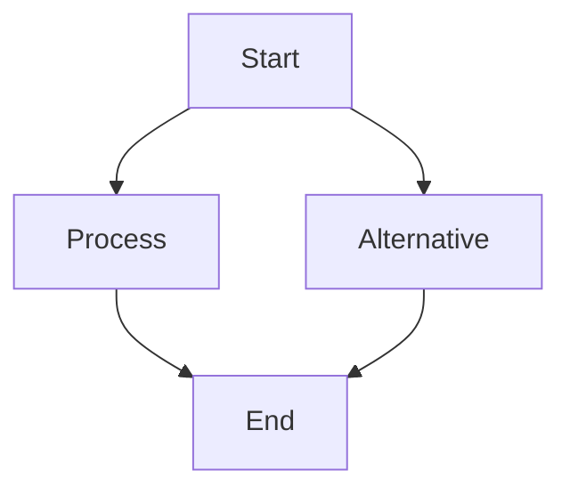

# Markdown Reference Guide

## Table of Contents

- [Markdown Reference Guide](#markdown-reference-guide)
  - [Table of Contents](#table-of-contents)
  - [Basic Syntax](#basic-syntax)
  - [Extended Syntax](#extended-syntax)
  - [Document Structure](#document-structure)
    - [YAML Front Matter](#yaml-front-matter)
    - [Internal Document Links](#internal-document-links)
    - [External Document Links](#external-document-links)
  - [Code Blocks](#code-blocks)
    - [Syntax Highlighting](#syntax-highlighting)
  - [Interactive Elements](#interactive-elements)
    - [HTML Embedding](#html-embedding)
  - [Diagrams](#diagrams)
    - [Mermaid Diagrams](#mermaid-diagrams)
    - [Mathematics](#mathematics)
  - [References](#references)
  - [Footer](#footer)

## Basic Syntax

| Element | Markdown Syntax | HTML Output |
|---------|----------------|-------------|
| Heading 1 | `# Heading 1` | `<h1>Heading 1</h1>` |
| Heading 2 | `## Heading 2` | `<h2>Heading 2</h2>` |
| Heading 3 | `### Heading 3` | `<h3>Heading 3</h3>` |
| Bold | `**Bold text**` or `__Bold text__` | `<strong>Bold text</strong>` |
| Italic | `*Italic text*` or `_Italic text_` | `<em>Italic text</em>` |
| Bold & Italic | `***Bold and italic***` | `<strong><em>Bold and italic</em></strong>` |
| Strikethrough | `~~Strikethrough~~` | `<del>Strikethrough</del>` |
| Blockquote | `> Blockquote text` | `<blockquote>Blockquote text</blockquote>` |
| Ordered List | `1. First item`<br>`2. Second item` | `<ol>`<br>`<li>First item</li>`<br>`<li>Second item</li>`<br>`</ol>` |
| Unordered List | `- List item`<br>`- Another item` | `<ul>`<br>`<li>List item</li>`<br>`<li>Another item</li>`<br>`</ul>` |
| Nested List | `- Item`<br>`  - Nested item` | Nested `<ul>` or `<ol>` structure |
| Horizontal Rule | `---` or `***` or `___` | `<hr>` |
| Link | `[Link text](https://example.com)` | `<a href="https://example.com">Link text</a>` |
| Reference Link | `[Link text][ref]`<br><br>`[ref]: https://example.com` | `<a href="https://example.com">Link text</a>` |
| Image | `` | `` |
| Reference Image | `![Alt text][img]`<br><br>`[img]: image.jpg` | `` |

## Extended Syntax

| Element | Markdown Syntax | Notes |
|---------|----------------|-------|
| Table | `\| Header 1 \| Header 2 \|`<br>`\|---------- \|---------- \|`<br>`\| Cell 1 \| Cell 2 \|` | Creates HTML tables |
| Fenced Code Block | ` ```language`<br>`code here`<br>` ``` ` | Syntax highlighting |
| Inline Code | `` `code` `` | For small code snippets |
| Footnote | `Text with footnote[^1]`<br><br>`[^1]: Footnote content` | Not supported in all parsers |
| Definition List | `Term`<br>`: Definition` | Not supported in all parsers |
| Task List | `- [x] Completed task`<br>`- [ ] Incomplete task` | Supported in GitHub Markdown |
| Emoji | `:smile:` | Supported in GitHub Markdown |
| Highlight | `==highlighted text==` | Not supported in all parsers |
| Subscript | `H~2~O` | Not supported in all parsers |
| Superscript | `X^2^` | Not supported in all parsers |

## Document Structure

### YAML Front Matter
```yaml
---
layout: default
title: "Document Title"
author: "Your Name"
date: "March 23, 2025"
css: styles.css
---
```

### Internal Document Links
```markdown
[Jump to section](#section-id)
```
Note: Section IDs are usually the lowercase section name with spaces replaced by hyphens.

### External Document Links
```markdown
[Related document](path/to/document.html)
```

## Code Blocks

### Syntax Highlighting
```markdown
```python
def hello_world():
    print("Hello, World!")
```
```

### Inline Code
```markdown
The `print()` function outputs text to the console.
```

## Interactive Elements

### HTML Embedding


```html
<button onclick="toggleVisibility()">Toggle Content</button>
<div id="content" style="display:none;">
  Hidden content that can be toggled.
</div>

<script>
function toggleVisibility() {
  var content = document.getElementById("content");
  if (content.style.display === "none") {
    content.style.display = "block";
  } else {
    content.style.display = "none";
  }
}
</script>
```

## Diagrams

### Mermaid Diagrams
```markdown

```

Renders as:


### Mathematics

Inline math: `$e^{i\pi} + 1 = 0$`

Display math:
```markdown
$$
\frac{d}{dx}(e^x) = e^x
$$
```

## References

- [Markdown Guide](https://www.markdownguide.org/)
- [GitHub Flavored Markdown](https://github.github.com/gfm/)
- [Pandoc Markdown](https://pandoc.org/MANUAL.html#pandocs-markdown)

## Footer

```html
<footer>
  <p><a href="index.html">Back to Home Page</a></p>
  <p>© 2025 Your Name. All rights reserved.</p>
</footer>
```