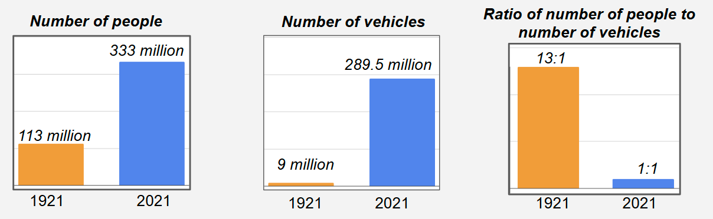

<link rel="stylesheet" href="{{ '/assets/css/worksheets.css' | relative_url }}">

# P3L1 Reviewing Historical Collision Data

---

### The Physics of Car Collisions: A Historical Perspective

In the early days of automobiles, driving was a dangerous and often deadly activity. When cars first appeared on roads in the early 1900s, there were no safety standards, traffic signals, or even basic requirements for driver training. Vehicles lacked essential safety features we take for granted today, such as windshields, headlights, and brakes that worked reliably. This resulted in numerous accidents, with both drivers and pedestrians at serious risk.

The need for safety regulations became increasingly apparent as more cars filled the streets. Pedestrians were especially vulnerable, as they shared the roads with automobiles in an unorganized system. Before the 1930s, there were no speed limits, no clear traffic rules, and no standardized road signs. These conditions led to a public safety crisis, with accident rates soaring and public demand growing for government intervention. This chapter will explore how our understanding of physics helped shape modern car safety standards and how these regulations have saved countless lives.

---

### Part 1: One Hundred Years of Change

**Figure 1. (A) Population, (B) Number of vehicles, and (C) Ratio of people to vehicles in 1921 (orange) and 2021 (blue).**

---

> In a simple t-chart, record observations and any wonderings about the historical driving data presented.

| I notice... | I wonder... |
|---|---|
|        |       |

---

## Checkpoint 2

Based on the statistics in the table and figure above, has driving become more or less safe over time?

Produce a copy of the table below in your Science Notebook. Brainstorm at least *three* factors that have changed between 1921 and 2021 that would make driving more or less safe.

| More Safe | Less Safe |
|---|---|
|        |       |

---

### Part 2: Quantifying Safety

#### Making Predictions

Driving safety can be measured in multiple ways. In your science notebook, make predictions for how the following quantifiable safety metrics have changed over time:
1. Number of vehicle collisions (vehicle-vehicle)
2. Number of pedestrian collisions (vehicle-pedestrian)
3. Number of injuries
4. Number of fatalities

---

#### US Vehicle Collision Statistics

> Review the safety statistics below. In your science notebooks, produce rough sketches of major patterns/trends in the data. An example has been provided for you below:
>

{style="width:250px"}

Below each trendline sketch, write pattern statements for different intervals of trendline you observed. 

- For example, US vehicle crashes decreased between 2005 and 2011.

---

{style="max-width: 70%"}

{style="max-width: 70%"}

{style="max-width: 70%"}

{style="max-width: 70%"}

