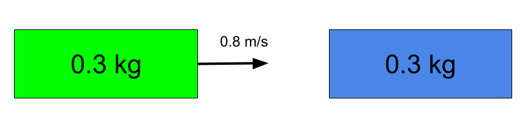
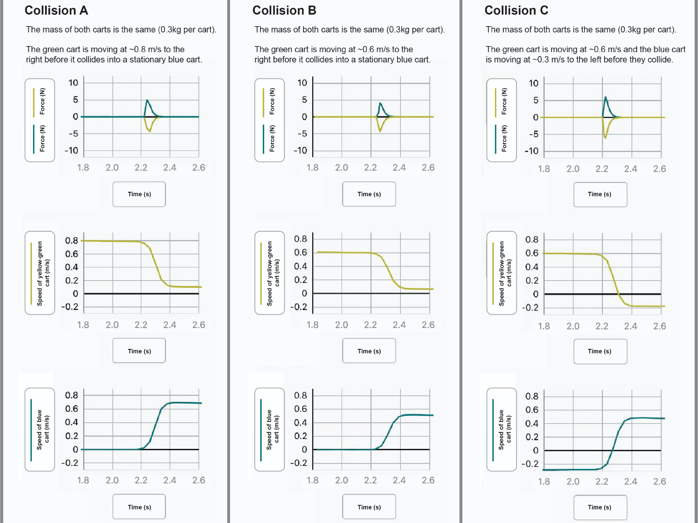
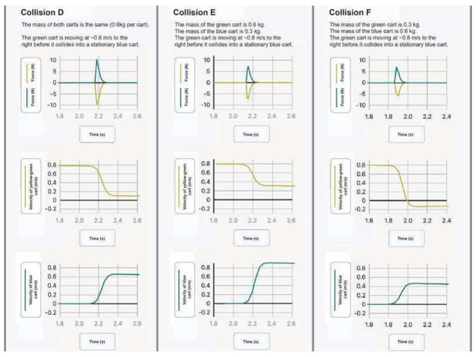

# P3L4 Speed and Collision Outcomes

---

## Part 1: Speed and Collisions {#navigate-1}

Even when you cannot prevent a collision, braking can help slow your car down before it collides with another car.

**How will the speed of a vehicle at the moment of first contact in a collision affect the outcomes?**

# Checkpoint 1: Make a Prediction

In your notebook, predict how you think speed will affect collision outcomes (what happens after a collision) and explain your reasoning.

In real-world collisions, slowing down a vehicle before impact can significantly change the outcomes. This lesson explores how speed affects collisions using scaled-down models that allow us to observe and measure these effects safely.

### Observing Collisions {#analyze-1}

Let's observe three different collisions between two carts and notice what happens in each case.

   <iframe 
      width="560" 
      height="315" 
      src="https://www.youtube.com/embed/5F6rEvlSsW0?si=obNdubVZ9Nl6lj4p" 
      title="Collisions Demo Video" 
      frameborder="0" 
      allow="accelerometer; autoplay; clipboard-write; encrypted-media; gyroscope; picture-in-picture" 
      allowfullscreen>
   </iframe>

### Experimental Design | Collisions A - C

> Copy the table below into your science notebook. In the table, make quick before and after sketches of the three collision scenarios A, B, and C. An example "before" sketch is provided for you.
> Use labelled arrows to show velocities before and after. Direction can be shown for final/"after" velocities even if the values are not known.

|Collision|Before|After| Notes|
|---------:|:------:|:-----:|:-:|
|A| ||
|B||||
|C||||

### Data Collection
**Activity:** As you watch the video, observe:
- What happens to each cart's speed after collision?
- Which cart slows down? Which speeds up?
- How do the different collision scenarios compare?

### Initial Explanations 

> What is happening during these collisions that is *causing* the yellow-yellow cart (left) to slow down and the blue cart (right) to speed up? Write your initial explanation in your notebook.

Remember our previous unit where we developed a model showing how **energy transfer** from one object/system to another was the result of **force** interactions. 

Since the carts make contact for a relatively brief period of time during a collision, let's consider a **forces** perspective and think about how the contact forces between the two cars during that time could help explain the outcomes we observed.

# Checkpoint 2: Predicting Force Interactions 

If we could measure the contact force(s) between the carts during the collision, how would we expect they would compare?

**Consider these possibilities:**
- Only cart A would be pushed on by the other cart.
- Only cart B would be pushed on by the other cart.
- Both carts A and B would be pushed on, but the strength of the forces on each would be different.
- Both carts A and B would be pushed on, and the strength of the forces on each would be the same.

Make your prediction before continuing. What evidence do you have for your prediction?

### Notes on Forces and Velocity
It is suggested that you copy the following notes into your science notebook for future reference.

- **Forces** are a vector quantity, meaning they are described with both magnitude (size) and direction
  - **Magnitude** - the magnitude of a force is its strength, independent of direction
  - Positive and negative signs are used to indicate direction
  - Forces acting in opposite directions are assigned opposite signs (positive/negative)
    - Positive force = push to the right
    - Negative force = push to the left
- Subscripts are used to indicate the sources of forces:
  - $F_{AB}$ is read as "The force F of A on B" and indicates the force that Cart A exerts on Cart B.
  - Forces are equal and opposite according to Newton's Third Law of Motion:
    - $F_{AB} = -F_{BA}$
    - We say, then, that the force of A on B is equal in magnitude and opposite in direction to the force of B on A.

- **Velocity** is also a vector quantity with:
  - Magnitude (speed)
  - Direction
  - Opposite directions are assigned opposite signs:
    - Negative velocity = moving to the left
    - Positive velocity = moving to the right
  - **Speed** is just the magnitude of velocity (ignoring direction)
- **Displacement** is a vector quantity that describes the change in position of an object:
  - Displacement = Final Position - Initial Position
  - Displacement can be positive or negative depending on the direction of motion
  - **Distance** is just the magnitude of displacement; it describes how far an object has traveled, regardless of direction.

## Part 2: Understanding Force Data in Collisions

To get more insights about what's happening during the brief moment of collision, we need special sensors that can collect force and velocity data before, during, and after a collision.

<iframe 
      width="560" 
      height="315" 
      src="https://www.youtube.com/embed/oU7cI4sSMbQ?si=kadtGynEJfcRf74k" 
      title="Collisions Demo Video" 
      frameborder="0" 
      allow="accelerometer; autoplay; clipboard-write; encrypted-media; gyroscope; picture-in-picture" 
      allowfullscreen>
   </iframe>

## Part 3: Velocity and Speed in Collisions

Now let's analyze how the speeds of the carts changed during the collisions.

<a href="../../../../assets/images/p3_collisions/p3l4_images/collisions_a-c.png" target="_blank" alt="Collisions A-C - Click image to view full size">
   

Click image to view full size in a new window

# Checkpoint 3: Force Data Analysis

**Data Analysis:** Study the force graphs for all three collisions and write your answers to the following prompts in your Science Notebook.
- When does the force begin and end for each collision?
- How do the force magnitudes compare between the carts?
- What similarities and differences do you notice across the three collisions?

### Interpreting Force Direction Data

In the data, we noticed that the force measured on the yellow cart is negative while the force measured on the blue cart is positive.

**What does the sign of the force tell us?**

Remember that force is a vector quantity with both magnitude and direction:
- A positive force means the cart is being pushed to the right (which *we* defined as positive)
  - A negative force means the cart is being pushed to the left
  - It would be just as correct to say that a positive force is a push to the right and a negative force is a push to the left
- The magnitude (absolute value) tells us how strong the push is

Using this understanding we see why the forces on the two carts have opposite signs during collision.

> **Data Analysis:** Study the speed graphs for all three collisions. You may wish to sketch their shapes into your notebook. Consider:
> - How do the speeds change during collision?
> - Compare the speed changes between collisions A, B, and C
> - What patterns do you notice?

## Understanding Velocity vs. Speed in Collision Data

In collision C, we noticed that the initial speed of the yellow cart is negative before the collision, and the blue cart has a negative speed after the collision.

**Analyzing the meaning of negative velocity:**
- When the yellow cart has a negative velocity, it is moving to the left
- When the blue cart has a negative velocity after collision, it is moving to the left
- The change from positive to negative (or vice versa) represents a change in direction

## Part 4: Mass Effects on Collisions 

### Experimental Design | Collisions D - F

Now let's explore how changing the mass of the carts affects collision outcomes.

> Copy the table below int your Science Notebook. Draw the experimental setup (as before) in the "before" column but for the new situations. Sketch your predictions in the middle column. Finally, record your observations in the final column after viewing the collisions.

**Make Predictions:** For each scenario, predict how changing mass will affect the force and velocity outcomes:

|Collision|Before|After   (Prediction)|After   (Observed)|
|-:|:-:|:-:|:-:|
|D   Double the mass of both carts||||
|E   Double the mass of the yellow (left) cart only||||
|F   Double the mass of the blue (right) cart only||||

## Analyzing Different Mass Scenarios {#analyze-4}

Now let's see what actually happens in these different mass scenarios.

<iframe 
      width="560" 
      height="315" 
      src="https://www.youtube.com/embed/DXFVadiFb_c?si=1SSRXDJn7APWFz1v" 
      title="Collisions Demo Video" 
      frameborder="0" 
      allow="accelerometer; autoplay; clipboard-write; encrypted-media; gyroscope; picture-in-picture" 
      allowfullscreen>
   </iframe>

**How does mass affect the forces on each object in a collision?**
**How does mass affect the change in velocity of each object in a collision?**

<a href="../../../../assets/images/p3_collisions/p3l4_images/collisions_d-f.png" target="_blank" alt="Collisions D-F - Click image to view full size">
   

> **Add terms below to make statements based on the data.**
> Based on our data analysis, we can make two key observations:
> 1. Increases in mass in the system resulted in ______________________ in the magnitude of the forces
> 2. When masses are unequal in a collision, the ____________________ mass changes velocity more than the ____________________ mass

## Part 4 Mathematical Relationships

Let's examine the precise mathematical relationship between mass and velocity changes in our collisions.

### Velocity Data for Different Mass Scenarios

Let's organize the velocity measurements for Collisions E and F.

> Copy the table below into your science notebook. Then, add the mathematical relationship shown beneath it.

| Collision | Cart | Mass (kg)| Initial Velocity (m/s) | Final Velocity (m/s) | Change in Velocity (m/s) |
|:---------:|:----:|:----:|:---------------------:|:--------------------:|:------------------------:|
| E | Yellow | 0.6 | 0.79 | 0.33 | -0.46 |
| E | Blue | 0.3 | 0 | 0.92 | 0.92 |
| F | Yellow | 0.3 | 0.8 | -0.12 | -0.92 |
| F | Blue | 0.6 | 0 | 0.46 | 0.46 |

These data show us how changing mass affects the velocity outcomes in collisions, which we'll analyze mathematically below.

### **Mathematical Relationship**
The data reveal that:

$\frac{m_1}{m_2} = -\frac{\Delta v_2}{\Delta v_1}$

In other words, the ratio of masses equals the **negative reciprocal** of the ratio of velocity changes. This means when one object has twice the mass of another, its velocity change will be half as large (and in the opposite direction).

---

### **Example Calculation**

Let's calculate the velocity changes for Collision E:

For the yellow cart (double mass):

$\Delta v_{\text{yellow}} = v_{\text{final}} - v_{\text{initial}} = 0.33 \text{ m/s} - 0.79 \text{ m/s} = -0.46 \text{ m/s}$

For the blue cart (normal mass):

$\Delta v_{\text{blue}} = v_{\text{final}} - v_{\text{initial}} = 0.92 \text{ m/s} - 0 \text{ m/s} = 0.92 \text{ m/s}$

 

 

   Ratio of velocity changes:  
    
  $\frac{\Delta v_{\text{yellow}}}{\Delta v_{\text{blue}}} = \frac{-0.46 \text{ m/s}}{0.92 \text{ m/s}} = -0.5$

Ratio of masses:  

$\frac{m_{\text{yellow}}}{m_{\text{blue}}} = \frac{2m}{m} = 2$

Checking our relationship:

   

$\frac{m_{yellow}}{m_{blue}} = \frac{0.6 \mathrm{kg}}{0.3 \mathrm{kg}} = 2$

$-\frac{\Delta v_{\text{blue}}}{\Delta v_{\text{yellow}}} = -\frac{0.92}{-0.46} = 2$

The relationship is verified!

## Part 5: Applications & Assessment

### Real-World Applications and Example Problems

Let's apply our mathematical relationship to real-world situations. Copy these sample problems into your science notebook and solve them as reference examples.

Example 1: A large truck (20,000 kg) collides with a stationary shopping cart (20 kg). How will their velocity changes compare?

Using our relationship $\frac{m_1}{m_2} = -\frac{\Delta v_2}{\Delta v_1}$, calculate:
1. The ratio of masses between the truck and shopping cart
   

   Ratio of masses:

      $\frac{m_{\text{truck}}}{m_{\text{cart}}} = \frac{20,000 \text{ kg}}{20 \text{ kg}} = 1,000$
   

2. The ratio of velocity changes you would expect

   

   Expected ratio of velocity changes:

   $\frac{m_{\text{truck}}}{m_{\text{cart}}} = -\frac{\Delta v_{\text{cart}}}{\Delta v_{\text{truck}}}$
   
   $1,000 = -\frac{\Delta v_{\text{cart}}}{\Delta v_{\text{truck}}}$
   
   $\frac{\Delta v_{\text{cart}}}{\Delta v_{\text{truck}}} = -1,000$

   

3. If the truck's velocity decreases by 0.01 m/s, what would the shopping cart's velocity change be?
   

   If truck's velocity decreases by 0.01 m/s:

   $\Delta v_{\text{truck}} = -0.01 \text{ m/s}$
   
   $\frac{\Delta v_{\text{cart}}}{-0.01 \text{ m/s}} = -1,000$
   
   $\Delta v_{\text{cart}} = -0.01 \text{ m/s} \times (-1,000) = 10 \text{ m/s}$

   The shopping cart's velocity would increase by 10 m/s (about 22 mph)!
   

This helps explain why in collisions between vehicles of very different masses (like a truck and a car), the smaller vehicle experiences much more dramatic changes in velocity—which directly relates to safety outcomes for the occupants.

---

# Exit Ticket: Mass & Velocity Changes

Answer these questions on a half sheet of paper and turn it in at the end of class.

1. If a 3 kg cart collides with a 1 kg cart, what would be the ratio of their velocity changes? Show your work using the relationship we discovered.
2. How would increasing the mass of one cart affect its velocity change during a collision?
3. Why do smaller vehicles experience greater changes in velocity when colliding with larger vehicles? Explain using our mathematical relationship.
4. A 1500 kg car collides with a 3000 kg truck. The truck's velocity changes by 2 m/s. Calculate the car's velocity change.

