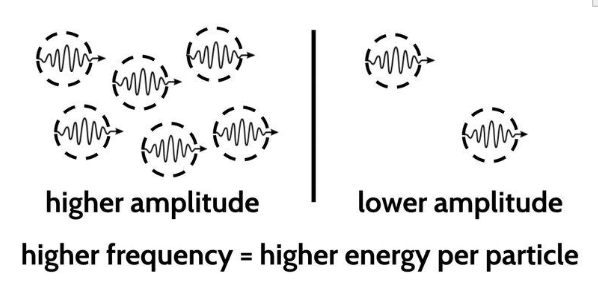
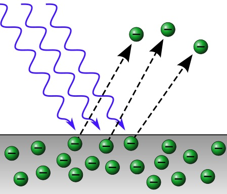

# The Particle Model of Electromagnetism

> Copy **Figure 1** below, including figure caption, into your science notebook. As you read, record your responses to the comprehension checkpoint questions in your science notebook.
 

**Figure 1.** Visual representation of amplitude and frequency in the particle model of EM radiation.

Evidence from interactions between electromagnetic radiation and photovoltaic (PV) panels was difficult to explain. Why did higher-frequency waves not transfer enough energy to move electrons but lower-frequency waves did? To explain the phenomena that the wave model could not, scientists developed a new model: the particle model. This model proposes that electromagnetic radiation is not a continuous wave, but rather a stream of tiny packets of energy called photons.

In the particle model, each photon carries a specific amount of energy that is proportional to its frequency. When we see EM radiation of a higher amplitude, this means more photons are traveling together. For example, a brighter flashlight puts out a greater number of photons than a dimmer flashlight.

In this model, photons are *quantum* units of light energy - distinct, individual packets. Here is one way to think about it: a photon can have "1 energy" or "2 energy" but it could never have 1.3, or 1.5 energy. The energy of each photon is the light's **frequency**; the **amplitude** in this model corresponds to the *number* of photons.

## Explaining the Photoelectric Effect

The particle model provides a natural explanation for the photoelectric effect. When a photon strikes a metal surface, it can transfer its energy to an electron. If the photon's energy is greater than the binding energy of the electron (the energy holding the electron in the metal), the electron is ejected.

{: class="figure-right"}

The energy of the ejected electron depends on the energy (frequency) of the photon, not the number (intensity) of photons. There is a threshold frequency because the photons must have enough energy to overcome the binding energy of the electrons in the metal. This explanation perfectly matches the experimental observations of the photoelectric effect, which the wave model could not account for.

## Effects of Photon Energy

### Cancer Risk and Ionizing Radiation
High-frequency photons (like UV, X-rays, and gamma rays) carry enough energy to eject electrons from atoms, creating ions. This ionizing radiation can damage DNA molecules by breaking chemical bonds. While low-frequency photons (like IR) only cause harmless thermal vibrations, high-frequency photons can trigger mutations that potentially lead to cancer. The risk increases with:
- Higher photon energy (frequency)
- Longer exposure time
- Higher intensity (more photons)

### Practical Applications: Photovoltaic Effect
Solar cells use silicon and other photovoltaic materials to convert photon energy into electrical energy. When photons with sufficient energy strike these materials, they eject electrons, creating an electric current. This process requires:
1. Photons with energy above the material's threshold frequency
2. Sufficient photon flux (intensity) for practical power generation

### Comprehension Checkpoint 2

Explain how the photovoltaic effect demonstrates the particle nature of light. Use the concept of a photon and possibly threshold frequency in your explanation.

<iframe src="<iframe src="https://docs.google.com/forms/d/e/1FAIpQLSeCg40rr0W2LpW_XPCuUWPyu0sMxV1mnadNmPPkyFC3stxknA/viewform?embedded=true" width="1024" height="920" frameborder="0" marginheight="0" marginwidth="0">Loading…</iframe>

