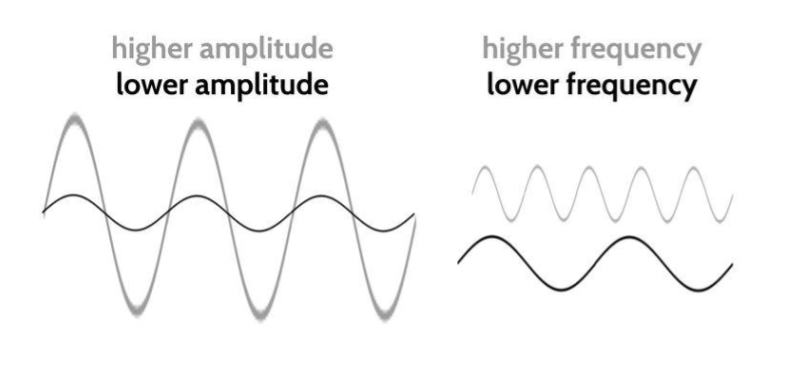
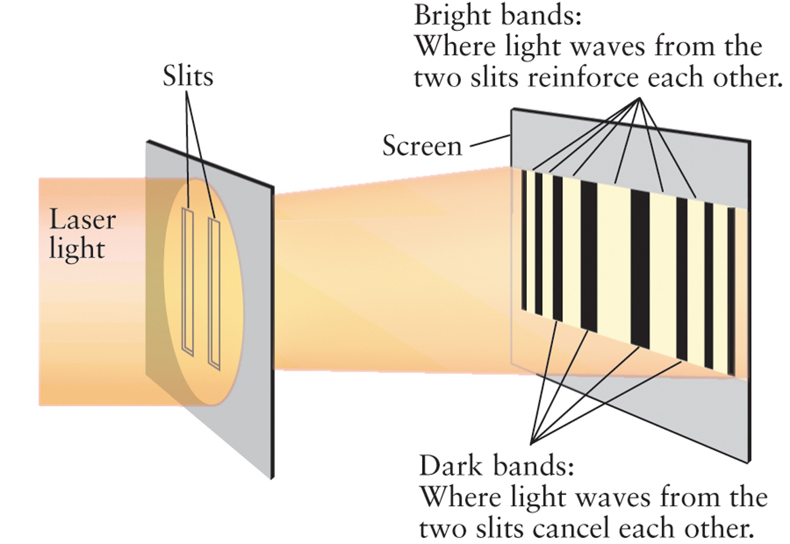
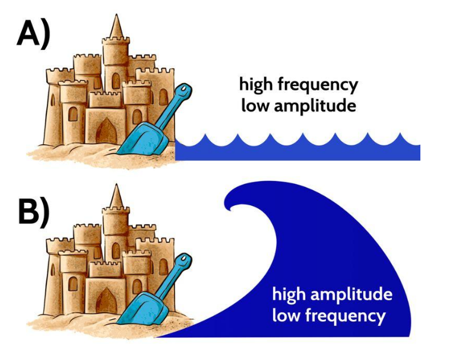

# The Wave Model of Electromagnetism

## Wave Variables in Wave-Particle Duality

---

> Copy **Figure 1** below, including figure caption, into your science notebook. As you read, record your responses to the comprehension checkpoint questions in your science notebook.

### The Mystery of Light

**Figure 1.** Visual representation of amplitude and frequency in the wave model of EM radiation.

Imagine a beam of light. What is it? For centuries, scientists have grappled with this question. Is it a wave, like the ripples in a pond, or a stream of particles, like tiny bullets? The answer, it turns out, is both, and neither, in a way that challenges our everyday intuition. We begin by exploring the evidence that led scientists to believe that light, and electromagnetic radiation in general, behaves like a wave.

The idea of waves is familiar to us. We see water waves on the ocean, hear sound waves in the air, and even feel seismic waves during an earthquake. The wave model describes these phenomena as disturbances that travel through a medium, transferring energy without transferring matter. In the case of electromagnetic radiation, the "disturbance" consists of oscillating electric and magnetic fields.

### Young's Double-Slit Experiment: A Landmark Discovery

One of the most convincing demonstrations of the wave nature of light is Young's double-slit experiment. In the early 19th century, Thomas Young conducted a simple yet profound experiment. He passed a beam of light through two narrow, closely spaced slits and observed the pattern of light on a screen behind the slits.

**Figure 2.** Simple schematic of Young's double-slit experiment. A beam of laser light was shone on a metal screen containing two slits. As the light transmitted through the slits, the interference pattern of the waves was visible on a second screen behind the slits.

A beam of light is directed through a screen with two slits and the interference pattern of the light waves is observed on a screen behind. Instead of seeing two bright lines (which is what one might expect if light were made of particles), Young saw a pattern of alternating bright and dark bands, called interference fringes. This pattern could only be explained if light were a wave. The light waves passing through the two slits spread out and overlap. Where the crests of the two waves meet, they reinforce each other, creating a bright band (constructive interference). Where a crest meets a trough, they cancel each other out, creating a dark band (destructive interference). This experiment provided strong evidence that light behaves as a wave.

Young's double-slit experiment highlights the phenomenon of interference. Interference is a property of waves where two or more waves combine to create a new wave pattern. When waves overlap, they can either reinforce each other (constructive interference), resulting in a larger wave, or cancel each other out (destructive interference), resulting in a smaller wave or no wave at all. Waves also have the ability to bend around obstacles and spread out after passing through narrow openings, a phenomenon called **diffraction**. This is why you can sometimes hear someone talking even if they are around a corner – sound waves diffract around the corner. Light also diffracts, although the effect is less obvious because the wavelengths of visible light are much smaller than those of sound waves.

The fact that electromagnetic radiation can exhibit both interference and diffraction provides strong evidence for its wave-like nature.

### Comprehension Checkpoint 1

Explain how Young's double-slit experiment demonstrates the wave nature of light. Use the concepts of **diffraction**, constructive and destructive interference in your explanation.

### The Limitations of the Wave Model

Despite its successes, the wave model cannot explain all aspects of electromagnetic radiation. As scientists delved deeper into the nature of light, they encountered phenomena that defied explanation by the wave model alone.

Imagine that you just built a large sandcastle at the beach.

{: class="figure-right"}

 Waves are crashing nearby, and eventually the waves are going to destroy your sandcastle. If we model EM radiation as a wave, we should consider the energy in each wave. Destroying a sandcastle is affected by both:
(A) the frequency of the water waves      (B) the amplitude of the water waves.

High-frequency water waves come crashing rapidly. Many waves hit every second, and your sandcastle is pummeled by lots of waves.
High-amplitude water waves are large, like a wall of water. If the frequency is low, the waves don’t hit often, but when they do, they are very destructive.

Some particle-scale events, such as ionizing an atom or producing an electron from the material on the surface of a solar cell, require a lot of energy at once in order to occur. This is similar to the energy from water waves destroying a sandcastle. Increasing the amplitude and/or frequency both increase a wave’s energy, but in the analogy, tall walls of high-amplitude water are more destructive than many tiny waves.

### Comprehension Checkpoint 2

Consider the analogy of EM radiation as a water wave destroying a sandcastle. What parts of this model are useful for understanding the ways in which EM radiation acts as a wave?

## Exit Ticket 
 

<iframe src="https://docs.google.com/forms/d/e/1FAIpQLSdCwubffbxIB0mHKvfSXIa3WwFTF5ndmrDM5fGDiBX6Ip81Rw/viewform?embedded=true" width="100%" height="850px" style="min-height: 100%; max-width: 100%; border: none; margin-bottom: 3rem; allowfullscreen: true;">Loading…</iframe>

