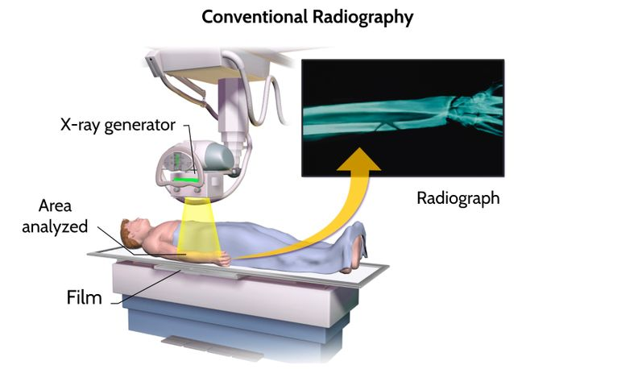
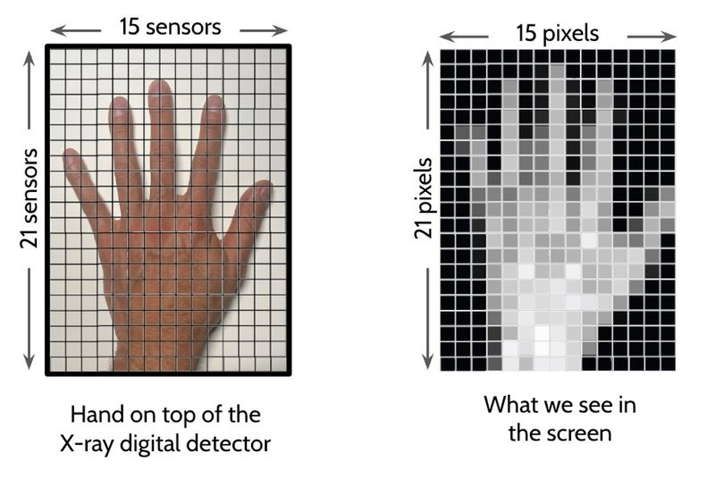
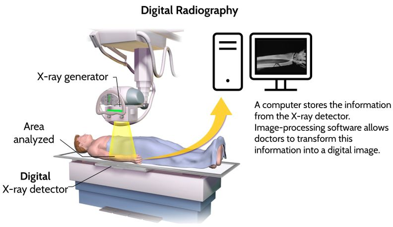

---
title:
author: Jonathan Corbett
layout: stemplate
date: ${CURRENT_YEAR} - ${CURRENT_MONTH}- ${CURRENT DATE}
topic: 
mathjax: true
---

# Radiography: Conventional versus Digital

Radiography, or the use of X-rays to create images of the internal structures of the human body, has revolutionized the field of medicine. The first X-ray was taken by Wilhelm Conrad Roentgen in 1895, and since then, radiography has become an essential tool in medical diagnosis and treatment. Over the years, the technology used in radiography has evolved from conventional photographic film to digital detectors. Let’s examine the differences between these two methods.

## Creating an Image Using Conventional Radiography
In conventional radiography, the patient is positioned between an X-ray machine and a piece of special film. This film is a see-through plastic sheet coated with a specific substance that can absorb X-ray radiation. A separate piece of film is required for each image taken. When the X-rays pass through the patient and hit the film, a chemical reaction occurs in the film as it absorbs them. The amount of X-rays absorbed by the film depends on how much is absorbed by various parts of the body as they pass through. For example, bones are quite dense and absorb lots of X-rays, so wherever a bone is between the generator and the film, very little radiation reaches the film. Organs and tissues that are less dense absorb less X-ray radiation, so more passes through them and reaches the film. The film is then dipped into a solution that causes chemicals to stick to it based on how much X-ray radiation was absorbed. This makes the parts of the film that absorbed more X-rays look darker. The parts of the film that absorbed less X-ray radiation look brighter and more transparent. 

Figure 1. In conventional radiography, patients are exposed to 

With this technology, the patient must be exposed to X-rays for a short time so the film can capture enough radiation to make a clear image. For example, a chest X-ray with conventional radiography may require an exposure time of 0.1-0.5 seconds for the chemical reaction to occur in the film and create changes that will be visible in the final radiograph. The patient must remain still during this time to prevent blurring of the image. X-rays are a type of ionizing radiation, which can be harmful, so to reduce the risk, patients are often given a lead apron or shield to cover the areas of the body not being imaged. Creating viewable images with conventional radiography can take from minutes to days, depending on the facility’s resources to process the film. Usually, only one image is made per exposure, which the patient can keep or share with other healthcare professionals.

## Creating an Image Using Digital Radiography
Digital radiography has now widely replaced conventional radiography for capturing detailed images of the inside of the human body. Like conventional radiography, an X-ray machine emits radiation that passes through the patient's body and is absorbed in different amounts by different tissues. But unlike conventional radiography, digital radiography uses a digital detector to capture the X-rays that pass through, and creates digital images instead of X-ray film.

How does the digital detector create a digital image?
An X-ray digital detector is a set of many individual sensors whose function is to convert the absorbed X-ray photons into electric currents. These currents determine the darkness of each pixel, or small square, of the resulting digital image. The X-ray digital detector shown below has 21 rows and 15 columns of sensors, which add up to 315 individual sensors. Each sensor corresponds to a pixel that is part of the digital image the doctor and patient will see on the screen. The number of sensors, and therefore pixels in the resulting image, varies depending on the size and type of detector. Most digital X-ray detectors have thousands of individual sensors arranged in a grid pattern, so the images they produce have a much higher resolution than the example below. Digital sensors can be used many times, creating many images without film waste.

The best way to understand how digital images are created out of pixels is to look at the screen of any modern device with a magnifying glass. If you look closely, you will see that the image is made up of a collection of very small squares, which are pixels.

The X-ray digital detector quantifies the number of photons that each sensor absorbs. For example, when X-rays pass through the patient’s arm, the bones absorb more photons, and very few pass through. Because a sensor right under the bone would receive and absorb very few photons, the detector would assign it a numerical value of 0. For other sensors that absorb many photons, the detector assigns a higher numerical value. Each numerical value corresponds with how dark the pixel will appear in the digital image. The fact that the image is represented as numbers is one reason it is considered digital information. In math, the word digital means “made of numbers.” The same is true in computer science.

These numerical values are stored as electrical charges in computer memory circuits. Those charges can be detected by the computer at any later time to retrieve and reconstruct the digital image that represents the number of photons each sensor detected. Because of this, the numerical (or digital) information composing the images stored in computer memory can be quickly transmitted to other computers. This makes digital radiographs quickly and easily accessible to radiologists and other healthcare professionals. In fact, anyone with access to that information can generate the images on their computer, which is why passwords are required to access medical records preventing unauthorized access or disclosure of sensitive health information. Despite these precautions, security breaches and unauthorized access to medical records can occur.

In digital radiography, patients are still exposed to the ionizing radiation and must wear appropriate shielding, such as lead aprons, to absorb the radiation that otherwise could reach sensitive organs and tissues. But unlike conventional radiographs, digital radiographs are created in a fraction of a second. For example, a chest X-ray with digital radiography may require an exposure time of only 0.02-0.1 seconds. This is because digital sensors are more sensitive to X-rays than the film used in conventional radiography. These sensors can detect low levels of X-ray radiation and produce the electrical signals used to create a digital radiograph.

**Figure 1.** In conventional radiography patients experience longer exposures to harmful x-ray radiation.

Similarly to how you can access a picture in a smartphone in a matter of seconds, the doctor’s computer can use the digital information to create the X-ray image in seconds. This eliminates the need for film processing and storage, which can be time-consuming and expensive. However, like the digital information stored in a smartphone, medical records stored digitally can be lost due to hardware failures, software glitches, accidental deletion, or other technical issues. If not properly backed up, this loss of data can result in significant disruptions or irretrievable loss of information critical to patients. Although recent developments have decreased the cost of digital radiography, the amount of resources required for the initial purchase of digital radiography equipment can limit access to this technology. This can create inequitable cost and quality of medical care.

##### References

Bansal, G. J. (2006). Digital radiography. A comparison with modern conventional imaging. Postgraduate Medical Journal, 82(969), 425-428.

DeStigter, K., Horton, S., Atalabi, O. M., Garcia-Monaco, R. D., Gharbi, H. A., Hlabangana, L. T., ... & Mendel, J. (2019). Equipment in the global radiology environment: why we fail, how we could succeed. Journal of Global Radiology, 5(1), e1079.

Use the photon model or the wave model of light to explain why the exposure time of digital radiography is much shorter than the exposure time of conventional radiography. 
How can we use this model to identify strategies that reduce harm from exposure to high-frequency EM radiation?
Based on all the information you gathered from this reading, what are the trade-offs of digital radiography versus conventional radiography?
